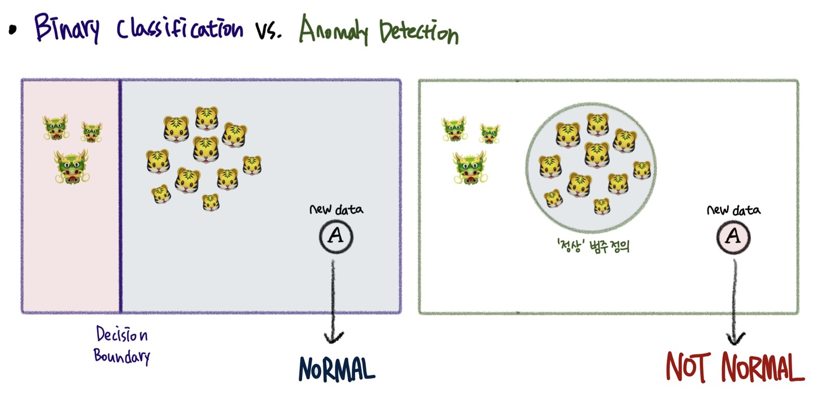

# Anomaly Detection
## Table of Contents

------------------

## Anomaly Detection: Overview

### Definition of Anomaly(Novel Data)

    

이번 튜토리얼은 'Anomaly Detection(이상치 탐지)'에 대한 주제로 진행하려 합니다. 그렇다면 이상치(Anomaly, Novel Data)란 무엇일까요? 위 사진을 보면, 양상은 다르지만 대부분 호랑이 객체밖에 없는 상황에서, 하나가 용이라면 이 용은 일반적인 객체들보다는 조금 다른 특이한 객체가 될 것입니다. 이처럼 __일반적인 데이터와는 다른 조금 특이한 객체를 Anomaly__ 라고 하고, 이를 찾아내는 것이 이상치 탐지의 목적입니다.

보다 학술적으로는, 아래와 같이 Anomaly를 2가지 관점에서 정의할 수 있습니다.   

1. __데이터 생성 메커니즘__ 에서의 관점: 일반적인 데이터와는 다른 메커니즘에 의해 발생한 데이터    
"Observations that deviate so much from other observations as to arouse suspicions that they were generated by a different mechanism (Hawkins, 1980)"   

2. __데이터 분포에서의 밀도__ 에 대한 관점: 객체들이 발생할 수 있는 확률 밀도가 낮은 데이터   
“Instances that their true probability density is very low (Harmelinget al., 2006)"

 

> __(참고) Anomaly vs. Noise__   
> 이상치 데이터는 노이즈 데이터와는 다릅니다. 노이즈는 데이터 수집 과정에서의 무작위성(Randomness)에 기반하여 자연 발생적으로 들어가는 변동성을 의미하며, 따라서 데이터 분석 시 정확히 가려 지워내는 것이 아니라 데이터에 노이즈가 내재되어 있다는 가정 하에 분석을 진행해야 합니다.   
>
> 반면 이상치는 __분석 과정에서 반드시 찾아내야 하는 "흥미가 있는 객체"__ 라고 이해해야 합니다. 일반적인 데이터를 생성하는 메커니즘을 위배하여 만들어진 데이터이기 때문에, 이를 발견하여 __XAI와 같이 사후적인 분석을 수행해야 할 필요가 있고, 그 객체를 찾아내는 것 자체만으로도 분석에 매우 도움이 되기 때문__ 입니다.   

 

그렇다면 이런 의문이 들 수 있겠죠. 이상치 탐지를 하고 싶을 때, 정상과 이상을 분류해낼 수 있는 Binary Classification 알고리즘을 적용하면 안 되는 걸까요? **왜 우리는 Anomaly Detection이라는 새로운 분야의 알고리즘을 필요로 하는 걸까요?**   

 

### Binary Classification vs. Anomaly Detection

    

전통적인 지도학습(Supervised Learning) 관점에서 Binary Classification은 주어진 데이터를 잘 구분하는 분류 경계면(Decision Boundary)을 잘 찾아내는 것을 목적으로 합니다. 위 그림의 예를 봅시다. 만일 호랑이🐯가 Normal이고 용🐲이 Abnormal 데이터라고 한다면, **Binary Classifier**는 **새로운 데이터 "A"를** 무엇으로 판단할까요? Normal Class의 경계면 안쪽에 속해있기 때문에 **Normal이라고 판단**할 것입니다.    

이때 우리는 이러한 질문을 던질 수 있습니다. **Abnormal🐲 관측치가 절대적으로 적은 상황에서, 해당 데이터가 Abnormal Class를 대표할 수 있는가?"** 에 대해 말입니다. 
왜냐하면 적은 관측치를 바탕으로 생성된 분류 경계면을 온전히 신뢰할 수 없기 때문이죠. 생각해보니 새로운 데이터 "A"는 'Normal'이라고 판단하기에는 다른 정상 관측치들(🐯)과는 Feature Space 상의 거리가 꽤 먼 것을 볼 수 있습니다.  
 
바로 이러한 문제를 바탕으로, Anomaly Detection은 **Normal 데이터는 충분히 많으니, "정상"이란 무엇인가를 정의하여 이에 포함되지 않는 것을 걸러내보자**는 아이디어에서 출발하게 됩니다. 이러한 관점에서 **새로운 데이터 "A"** 는 Anomaly Detection의 관점에서는 **Normal이 아닌 것**으로 재정의되겠죠.   

> **(참고)**   
> Normal이 아니라고 해서 데이터가 반드시 "Abnormal"인 것은 아닙니다. 하지만 현 관측치를 기준으로 보았을 때 해당 데이터는 우리가 규정한 "Normal"이라 하기에는 어려움이 있습니다. 이러한 접근법이 유효한 이유는 "Abnormal"의 종류가 2가지일 때입니다. 가용할 수 있는 불량 관측치가 하나의 유형(이를테면 🐲)밖에 없는 상황에서, 한 번도 관측되지 못했던 새로운 불량 유형(이를테면 🦁)을 발견할 수 있다는 이점을 가지기 때문입니다. 이러한 관점에서 Anomaly Detection을 통해 찾아낸 데이터는 불량, 오류, 악성코드, 가짜 데이터일 수도 있지만, 예외, 새로운 패턴 등의 데이터일 수도 있습니다.
> 
> 이처럼 Classification은 데이터를 반드시 주어진 범주 중 하나로 할당하지만, Anomaly Detection은 정상의 Boundary를 정하고 '정상' '정상이 아님'으로 보다 광범위한 분류가 가능하다는 측면에서 둘은 차이를 가집니다. 즉, Anomaly Detection은 일반적인 데이터의 범주와 확연히 구분되는 다른 양상의 데이터를 찾는 것이죠.

 

### Assumption of Anomaly Detection
이상치 데이터의 기본 가정은 **정상 데이터가 정상이 아닌 데이터보다 훨씬 더 많다**(There are considerably more "normal" observations than abnormal observations in the data)입니다. 그리고 모델링 시에는 **오로지 정상 데이터만을 활용하여 모델을 학습**시킨 후, 정상 범위를 정의하여 이상을 탐지해내는 것을 기저로 활용하고 있습니다.   

 

-------

## Dive into Anomaly Detection Using AutoEncoder
이러한 점을 바탕으로, 본 튜토리얼에서는 Anomaly Detection에 대해서, 그 중에서도 딥러닝 모델을 바탕으로 수행되는 **AutoEncoder Based Anomaly Detection**에 대한 간략한 소개 및 활용 방안에 대해 소개해보고자 합니다. 이때 **딥러닝 기법을 활용한 모델 기반의 Anomaly Detection을 소개하는 이유는, 데이터가 내포하는 정보를 최대한 활용하는 동시에 구조를 유연하게 바꾸어가며 모델 성능을 높일 수 있는 장점을 가지기 때문**입니다. 따라서 모델을 학습시킬 만큼의 충분한 데이터가 있다면 본 튜토리얼을 통해 딥러닝, 그 중에서도 AutoEncoder를 이용한 Anomaly Detection의 기본을 알아갈 수 있을 것입니다.

특히 본 튜토리얼에서는 **시계열 데이터에 있어 이상 탐지에 대한 튜토리얼**을 작성하고자 하며, 활용하고자 하는 데이터는 **Real-World Time Series Dataset 중 Electrocardiogram(ECG) 심전도 데이터셋**입니다. 

### AutoEncoder

    

AutoEncoder는 통상적으로 위와 같은 구조를 가지는 모델로, **입력과 출력이 동일한 인공 신경망 구조**를 바탕으로 **입력으로 받은 데이터(x)를 출력으로 최대한 가깝게 재구축(x')하는 것을 목적**으로 하고 있습니다. 분석 데이터셋이 어떤 형태인지(e.g. Time Series, Image, NLP, etc.)에 따라서 다양한 종류의 모델을 설계할 수 있지만, 기본적인 구조는 모두 동일합니다.   

- **Encoder**: 주어진 Input을 차원 축소를 통해 Latent Vector(= Hidden Representation)로 변환하는데, 이때 원본 데이터의 정보를 잘 보존하는 방향으로 압축하는 것이 Enocder의 목적입니다.   
- **Decoder**: 일종의 Generator로서, Input으로 들어온 Latent Vector를 이용하여 다시 Input과 유사하게 데이터를 재구축(Reconstruction)하는 역할을 수행합니다.   
- **Objective Function**: $l(f(x)) = \frac{1}{2}\sum_{k}(\hat{x_k}-x_k)^2$   
    - **실제 Input과 재구축한 Output 간의 차이를 최소화 하는 방향으로 모델 Parameters가 업데이트** 되도록 함을 의미합니다. 즉, 재구축된 Output(x')와 Input(x) 간의 차이를 줄이는 방향으로 학습이 이루어지는 것이죠.   
    - 이를 **Reconstruction Error**라고도 합니다.   

 

**그렇다면 어떻게 자기 자신을 입력으로 넣어 다시 재구축하는 것이 이상치 탐지가 되는 걸까요?**   
- 학습 시 Normal 데이터만을 활용한다면, **AutoEncoder는 Normal 값을 가지는 데이터의 주요한 특징들을 잘 파악하는 방향으로 학습이 이루어질 것**입니다. 따라서 제대로 학습된 모델은 정상적인 데이터에 대해서는 Reconstruction을 훌륭하게 수행할 수 있습니다.
- 그러나 만일 Anomaly 데이터가 들어온다면, 학습 시 한 번도 Anomlay를 보지 못했던 AutoEncoder는 Recosntruction을 잘 수행하지 못할 것입니다. 오로지 **Normal의 특징만을 학습했기 때문에, 정상이 아닌 특징을 가진 데이터에 대해서는 Reconstruction에 어려움을 겪는 것**이죠.
- 따라서 위 목적 함수에서 Reconstruction Error 값이 일정 수준(Threshold) 이상 높아진다면, 이를 Anomaly라 판단할 수 있는 것입니다.
    - 그렇다면 이 'Threshold'는 어떻게 정의해야 할가요? 그 기준은 데이터셋마다 그리고 도메인마다 다르므로, 본 튜토리얼에서는 **실험을 통해 적절한 Threshold를 정하는 과정을 아래에 소개**하고자 합니다.

 

### Python Implementation
Anomaly Detection과 AutoEncoder에 대한 기본 개념을 알았다면, 이제 Python 및 PyTorch를 활용해 모델을 직접 구현해보겠습니다.

### Dataset Description

ECG는 어떤 데이터셋인가?
5가지 클래스 중에서 Unclassifiable(Q)를 abnormal로 정의한다. 일반적인 부정맥이 아닌 다른 클래스를 탐지할 수 있을까?

### 실험 1: Latent Vector 차원에 따른 복원 값 차이
-> Bottelneck Layers == Original Data Dimension 일 때는 왜 성능이 좋지 않은지에 대해 기술.

### 실험 2: Threshold 변화에 따른 성능 차이 (https://github.com/cran2367/autoencoder_classifier/blob/master/autoencoder_classifier.ipynb)
-> Threshold 정하는 함수
-> F1-Score, Precision, Recall

### 실험 3: 정해진 Threshold를 바탕으로, Normal과 Anomaly의 복원 값 차이 확인
-> 시각적으로 확인.

### 실험 4: Vanilla Dense AutoEncoder 외에, 데이터의 시계열성을 반영하는 LSTM/Conv1D로 Backbone 바꾸어보기
-> 실험 2를 통해 Threshold를 정하고, 실험 3을 통해 복원 값 차이 확인
-> 실험 4의 결과로서 Vanilla vs. LSTM vs. Conv1D vs. LSTM+Conv1D 결과 각각 비교해보기 (https://velog.io/@tobigsts1617/4%EC%A3%BC%EC%B0%A8-AutoEncoder-%EA%B8%B0%EB%B0%98-%EC%9D%B4%EC%83%81%EC%B9%98-%ED%83%90%EC%A7%80-%EC%95%8C%EA%B3%A0%EB%A6%AC%EC%A6%98)

### 실험 5: 본 데이터는 Univariate Dataset임. 그렇다면 Multivariate은 어떨까? 다른 데이터를 통한 실험 수행. (https://arxiv.org/pdf/1809.10717.pdf)
-> 실험 2를 통해 threshold 정하기
-> 실험 3을 통해 복원 값 차이 확인하기
-> Vanilla / LSTM / LSTM+Conv 각각 성능 차이 확인하기
    └> 왜 이런 성능 차이가 났을지 고민하고 ECG와 결과 비교하기 

-------------
