# 2022 Business Analytics Chapter 4: Ensemble Learning 🤹‍♀️
## Python Tutorial: Bagging(Random Forest) vs. Boosting(Gradient Boosting & CatBoost)
### 2022010558 김지현🐲

<br/>

<br/>

# Ensemble Learning: Overview
프랑스어로 'ensemble'은 '조화' 혹은 '통일'을 의미합니다. 이 단어의 의미를 차용하여 이름 지어진 'Ensemble Learning'의 의미는, 단일 모델들을 여러 개 모아 학습시켜, 각 모델의 예측 값을 취합하는 방식을 뜻합니다. 따라서 Ensemble Learning은 일반적으로 단일 모델보다 더 나은 성능을 자랑한다는 특징을 가집니다.   

**그렇다면 Ensemble Learning으로 어떻게 더 나은 성능을 가질 수 있는 걸까요?**

<br/>

## <span style="color:darkblue">Bais</span>-<span style="color:purple">Variance</span> Decomposition
우리가 만드는 예측 모델은 미래에 들어오는 새로운 x 데이터에 대한 예측 오차의 기댓값을 줄이는 것을 목표로 하며, 이때 **오차**의 기댓값은 모델의 **Bias(편향)** 와 **Varaince(분산)** 로 분해됩니다.   

<p align="center">
    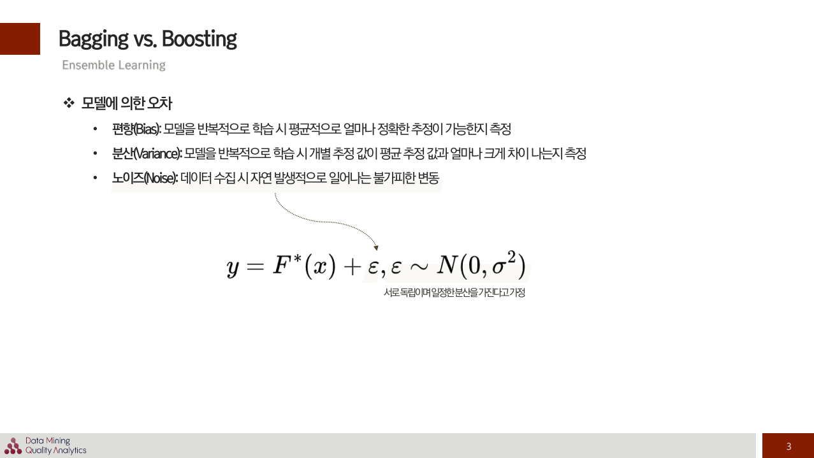
</p>

물론 오차에는 Bias와 Variance만 있는 것이 아닙니다. Noise라 하여, 데이터 수집 시에 자연 발생적으로 일어나는 불가피한 변동도 있죠. 이전 [Anomaly Detection 튜토리얼](https://github.com/Im-JihyunKim/BusinessAnalytics/blob/main/Anomaly_Detection/Anomaly_Detection_Tutorial.md)에서도 다루었지만, 노이즈는 정확한 추정은 불가능하고, 다만 서로 독립적이고 일정한 분산을 가진다고 임의로 가정하는 값입니다. 그리고 잘 모르니 가우시안 분포를 따른다고 가정하죠.   

그렇다면 Bias와 Variance는 무엇일까요? 위 슬라이드에도 적혀있지만, 먼저 **<span style="color:darkblue">Bias는 모델을 반복적으로 학습시켰을 때 도출되는 예측 값의 평균**을 의미합니다. 평균적으로 얼마나 정확한 추정이 가능한지를 측정하는 지표이죠. **<span style="color:purple">Variance는 모델을 반복적으로 학습시켰을 때 개별적인 예측 값이 평균 예측 값과 얼마나 차이 나는지를 측정**하는 지표입니다. 예측 추정 값의 편차를 계산하는 지표인 것이죠.

이때 모델의 오차가 Bias와 Variance로 Decomposition 된다는 의미는 뭘까요? 만일 우리의 예측 Task가 Regression이고, 예측 오차를 MSE를 통해 계산한다고 해봅시다. 그렇다면 데이터 $x_0$가 들어왔을 때 모델의 Error는 아래와 같습니다.

$$Expected \ MSE(x_0) = E[y-\hat{F}(x)|x=x_0]^2$$

이때 추정 값은 언제나 노이즈를 가지기 때문에, epsilon을 이용해서 아래처럼 다시 표기할 수 있겠죠. Nosie는 독립으로 가정하니 바깥으로 다시 빼서 $\sigma ^2$로 표현합니다.

$$\begin{aligned}
Expected \ MSE(x_0) &= E[y-\hat{F}(x)|x=x_0]^2 \\
&= E[F^*(x_0)+ε - \hat{F}(x_0)]^2 \\
&= E[F^*(x_0) - \hat{F}(x_0)]^2 + \sigma ^2
\end{aligned}$$

앞서 언급한 Bias와 Variance에 대한 개념을 짚어봅시다. 둘 모두 "예측 값의 평균 $\bar{F}(x)$"을 이용하여 계산됩니다. 그렇다면 위 수식에서 예측 값의 평균을 더하고 빼주면 어떻게 될까요? 동일한 값을 더하고 빼주니 수식은 동일해지겠죠.

$$\begin{aligned}
Expected \ MSE(x_0) &= E[y-\hat{F}(x)|x=x_0]^2 \\
&= E[F^*(x_0)+ε - \hat{F}(x_0)]^2 \\
&= E[F^*(x_0) - \hat{F}(x_0)]^2 + \sigma ^2 \\
&= E[F^*(x_0) - \bar{F}(x_0) + \bar{F}(x_0) \hat{F}(x_0)]^2 + \sigma ^2
\end{aligned}$$

맨 아래 수식을 보니 $(A+B)^2$ 의 꼴입니다. 이를 풀어서 전개해보겠습니다.

$$\begin{aligned}
Expected \ MSE(x_0) &= E[y-\hat{F}(x)|x=x_0]^2 \\
&= E[F^*(x_0)+ε - \hat{F}(x_0)]^2 \\
&= E[F^*(x_0) - \hat{F}(x_0)]^2 + \sigma ^2 \\
&= E[F^*(x_0) - \bar{F}(x_0) + \bar{F}(x_0) \hat{F}(x_0)]^2 + \sigma ^2 \\
&= E[F^*(x_0)-\bar{F}(x_0)]^2 + E[\bar{F}(x_0)-\hat{F}(x_0)]^2+σ^2 \\
&= \color{Purple} \color{DarkBlue} [F^*(x_0)-\bar{F}(x_0)]^2 \color{Black}+ \color{Purple} E[\bar{F}(x_0)-\hat{F}(x_0)]^2 \color{Black}+σ^2 \\
&=\color{DarkBlue}Bias^2(F(x_0)) \color{Black}+ \color{Purple}Var(\hat{F}(x_0)) \color{Black} +σ^2
\end{aligned}$$

먼저 $\color{darkblue}F^*(x_0)-\bar{F}(x_0)$은 $x_0$가 진짜 정답 $F^*$와 $x_0$가 입력되었을 때 모델들의 예측 평균 $\bar{F}(x_0)$ 간의 차이를 계산한 식입니다. 즉, 이는 **<span style="color:darkblue">Bias(편향)** 를 의미하는 식인 것입니다.   

$\color{purple}\bar{F}(x_0)-\hat{F}(x_0)$ 은 $x_0$가 입력되었을 때 모델들이 예측한 값의 평균 $\bar{F}(x_0)$와 개별 예측 값 $\hat{F}(x_0)$ 간의 차이를 계산한 식입니다. 이는 **<span style="color:purple">Variance(분산)** 을 의미하는 식이 되겠죠.

결론적으로 임의의 미래 데이터 $x_0$의 오차 기댓값은, 모델의 **<span style="color:darkblue">Bias(편향)** 와 **<span style="color:purple">Variance(분산)**, 그리고 **Natural Error인 Noise** 총 3가지 요소로 분해할 수 있습니다. 그리고 Noise는 자연 발생적이고 불가피한 변동이니, 우리가 줄여나갈 수 있는 것은 Bias와 Variance가 되겠죠.   

### <span style="color:darkblue">Bias</span>와 <span style="color:purple">Variance</span>에 따른 모델 구분
그렇다면 예측 모델은 위에서 말한 오류에 따라, Bias가 낮은 모델과 Variance가 낮은 모델로 구분할 수 있을 것입니다.   

**<span style="color:darkblue">모델의 Bias**가 크고 작다는 것은 결국 무슨 의미일까요?
- **<span style="color:darkblue">모델의 Bias가 크다면**, 우리의 학습 데이터의 패턴을 제대로 반영하지 못했다는 의미, 즉 Training Error가 크다는 의미일 것입니다.
- **<span style="color:darkblue">모델의 Bias가 낮다면**, 학습 데이터의 패턴을 제대로 반영하여서 Training Error를 최소화 한다는 의미이겠죠. 실제 값과 예측 값 평균의 차이가 작다는 것이니까요.

**<span style="color:purple">모델의 Variance**가 크고 작다는 것은 다음과 같은 의미를 가집니다.
- **<span style="color:purple">모델의 Variance가 크다면**, 데이터가 바뀐다면, 모델의 예측 값에 많은 변동이 예상된다는 것입니다.
- **<span style="color:purple">모델의 Variance가 낮다면**, 데이터 및 하이퍼파라미터가 바뀐다 하더라도, 예측 값에 변동이 크지 않다는 의미입니다. Variance는 모델의 예측 값이 평균 예측 값으로부터 퍼진 정도를 측정하는 것이니, 예측 값 사이에 큰 차이가 없다는 것이죠.

이를 통해서 모델을 아래와 같이 총 4가지 경우로 구분할 수 있을 것입니다.
<p align="center">
    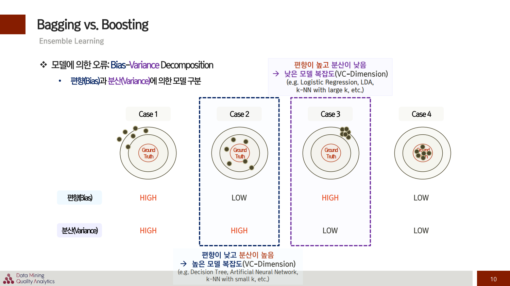
</p>

Case 1은 Bias와 Variance가 모두 높은 경우로, 성능이 매우 좋지 않은 Worst Case입니다. **우리가 다루는 대부분의 예측 모델은 Case 2와 Case 3로 구분**할 수 있죠.
- **<span style="color:darkblue">Case 2는 Bias가 낮고 Variance가 높은 모델**입니다.
    - Bias가 낮기 때문에 Training Error가 Case 3보다 낮지만, Variance가 높고 구간 추정 범위가 넓어 Testing Error가 높다는 특징을 가집니다. 즉 **Overfitting**의 경향을 보일 수 있는 모델이죠.
    - 이때 Case 2에 속하는 모델은 기본적으로 **모델의 복잡도(VC Dimension)가 높아 개별적인 Training Error(Empirical Error)가 낮습니다**.   

<br/>

- **<span style="color:purple">Case 3은 Variance가 낮고 Bias가 높은 모델**입니다.
    - Variance가 낮기 때문에 Training Error도 높고, Testing에 대한 예측력도 낮죠. 이는 **Underfitting**이 된 전형적인 모델의 예라고 할 수 있습니다.
    - Case 3에 속하는 모델은 기본적으로 **모델의 복잡도(VC Dimension)가 낮다는 특징**을 가지고 있습니다.

> <span style="color:gray">__[참고]__   
VC Dimension과 Empirical Error의 관계에 대해서는 [Kernel Based Learning 튜토리얼](https://github.com/Im-JihyunKim/BusinessAnalytics/blob/main/Ch2_Kernel_Based_Learning(SVM)_Tutorial.ipynb)에 보다 자세히 기술되어 있습니다.

<br/>

## <span style="color:darkblue">Bagging</span> vs. <span style="color:purple">Boosting
그렇다면 Ensemble Learning에서는 어떻게 단일모델보다 예측 오류를 감소시킬 수 있을까요?   
본 튜토리얼에서 다룰 Ensemble Learning의 방법론은 **<span style="color:darkblue">Bagging**과 **<span style="color:purple">Boosting**이며, 각 방법론은 다음과 같은 특징을 가집니다.   

<p align="center">
    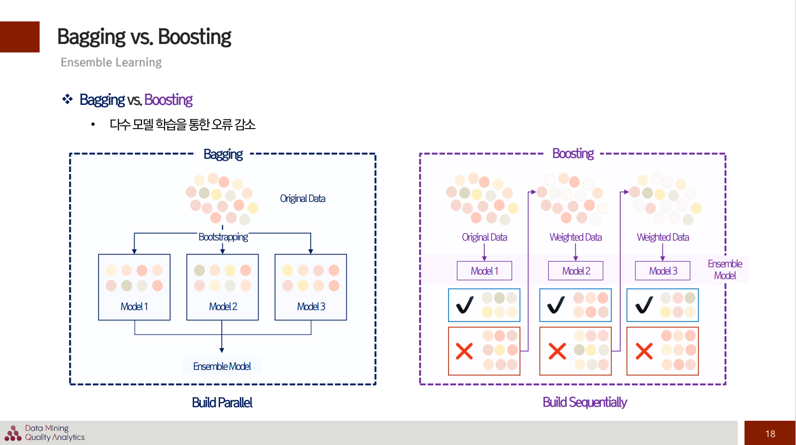
</p>

**<span style="color:darkblue">Bagging (Bootstrap Aggregating)</span>**:   
- **<span style="color:darkblue">학습 데이터셋을 Random하게 추출하여 모델을 각각 다르게 학습시키는 방법론**입니다.
- 따라서 **<span style="color:darkblue">개별 모델들은 서로 독립적**이며 영향을 주고 받지 않는다는 특징이 있습니다. 즉, 각 모델들의 학습 및 추론이 **<span style="color:darkblue">병렬적(Parallel)** 으로 이루어지는 것이죠.
- 이때 데이터를 무작위로 추출할 때, **중복을 허용하는 복원 추출이면 Bootstrapping**, 중복을 허용하지 않으면 Pasting이라 합니다.
- 일반적으로는 **<span style="color:darkblue">Bootstrapping을 통해 모델 별로 학습 데이터를 만들고, 이들을 aggregation하여 예측 값을 모으는 방식**을 택합니다. 그래서 "Bootstrap Aggregating"이라 이름 붙여진 것이죠.

**<span style="color:purple">Boosting**:   
- Boosting은 **<span style="color:purple">성능이 약한 Weak Learner를 여러 개 연결하여 Strong Learner를 만드는 방법론**입니다.
- 앞에서 학습된 모델의 약점을 보완해 나가면서 더 나은 모델로 학습시키는 방식이죠. 이를테면 **<span style="color:purple">이전 모델이 잘못 예측한 데이터에 가중치를 부여하고, 다음 모델이 이에 대한 오류를 개선해 나가며 학습 히는 방식**입니다.
- 따라서 **<span style="color:purple">선행 모델의 성과에 의존적**이며, 선행 모델의 가이드가 필요하기에 학습 및 추론이 **<span style="color:purple">순차적(Sequential)** 이라는 특징을 가지고 있습니다.

<br/>


<p align="center">
    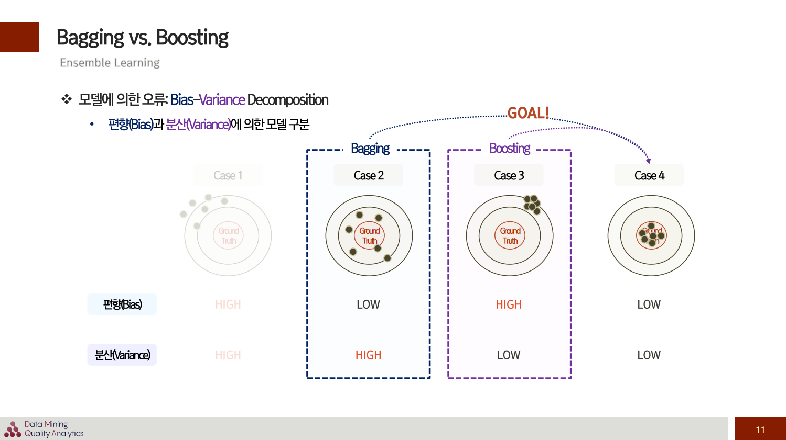
</p>

**<span style="color:darkblue">Bagging은 Case 2와 같이 Bias가 낮은 모델들을 이용해서 Variance를 줄여나가는 방식으로 예측 오류를 감소**시키는 방법입니다. 각 개별 모델의 성능은 좋지만, 그 편차가 있다면 이를 줄일 수 있는 방법론이죠.   
- Case 2의 상황에서 앙상블을 사용하지 않았을 때 **<span style="color:darkblue">Overfitting이 문제가 된다면, 이를 해결하는 데 Bagging 방식을 이용**할 수 있는 것입니다.

<br/>

**<span style="color:purple">Boosting은 Case 3과 같이 Variance가 낮은 모델들을 합쳐서 Bias를 줄이는 방식으로 예측 오류를 감소시키는 방법**입니다. Sequential하게 모델의 약점들을 보완해나가는 것이죠.   
- 즉, 예측 성능을 향상을 꾀하는 방식이기 때문에, **<span style="color:purple">앙상블 모델을 사용하지 않을 때 예측 성능이 문제 되면 Boosting 방식을 통해 성능을 높이는 것**이 일반적입니다.

<br/>
자 이제 Ensemble Learning의 이론적 배경뿐 아니라 Bagging과 Boosting의 차이를 알아 보았으니, 본격적으로 구체적인 알고리즘에 대한 설명 및 코드를 통해 이해를 높여보도록 하겠습니다.

<br/>

# Set up for Python Tutorial
```python
# Import Libraries
import time
import numpy as np
np.random.seed(2022)
import pandas as pd

# For visualiation
%matplotlib inline
import matplotlib
import matplotlib.pyplot as plt
import seaborn as sns
sns.set_context("talk")
sns.set_style("white")
sns.set_palette("Pastel1")
plt.rcParams['axes.labelsize'] = 14
plt.rcParams['xtick.labelsize'] = 14
plt.rcParams['ytick.labelsize'] = 14
plt.rcParams['axes.unicode_minus'] = False

from sklearn.datasets import make_classification, make_regression
from sklearn.model_selection import RepeatedStratifiedKFold, cross_val_score

import warnings
warnings.filterwarnings('ignore')
```

<br/>

# <span style="color:darkblue">Bagging 1: Bagging with Decision Tree
`Scikit-Learn`에서는 Bagging을 간편하게 사용할 수 있는 라이브러리를 제공하고 있습니다. 풀고자 하는 task가 Classification인 경우에는 `BaggingClassifier`를, Regression인 경우에는 `BaggingRegressor`를 제공하죠.   

본 튜토리얼에서는 Classification 문제를 풀며 각 알고리즘의 특징을 살펴보겠습니다.
```python
from sklearn.ensemble import BaggingClassifier
```
데이터셋으로는 [make_classification() 함수](https://scikit-learn.org/stable/modules/generated/sklearn.datasets.make_classification.html)를 이용하여 Binary Classification Task를 풀기 위한 가상 데이터를 만들어냅니다. 해당 데이터셋에는 20개의 설명 변수와 1,000개의 관측치가 포함되어 있도록 설정하였습니다.   

```python
# Define and Get Dataset
def get_dataset():
    X, y = make_classification(n_samples=1000, n_features=20, n_informative=15, 
                               n_redundant=5, random_state=2022)
    return X, y
```

<br/>

## <span style="background-color:#fff5b1"> [실험 1] Decision Tree vs. Bagging with Decision Tree
앞서 VC Dimension이 높은 단일 모델로 과적합이 발생하는 경향이 있을 때, Bagging을 통해서 이를 완화할 수 있다고 하였습니다. 그 대표적인 Base Learner로는 (1) Decision Tree, (2) Artificial Neural Network, (3) k-NN with small K 등이 있습니다. 이러한 모델은 또한 Variance가 높아 오류를 발생시키는 특징을 가지는데, **<span style="color:maroon">과연 Bagging을 통해서 성능을 향상시킬 수 있을까요?**   

**<span style="color:maroon">먼저 Decision Tree를 활용하여, 단일 모델의 성능과 Bagging의 성능 차이를 비교**해보겠습니다. 이때 **Bagging의 여러 Decision Tree의 예측 결과를 취합하는 데 있어서는, 각 모델의 Accuracy Score와 AUROC Score의 평균 값을 이용**합니다.

```python
from sklearn.tree import DecisionTreeClassifier
from sklearn.ensemble import BaggingClassifier
```
```python
# Define Data
X, y = get_dataset()

# Single Decision Tree
tree_clf = DecisionTreeClassifier(random_state=2022)

# Bagging with Decision Tree
bag_clf_tree = BaggingClassifier(
    DecisionTreeClassifier(random_state=2022), n_estimators=500, bootstrap=True, n_jobs=-1, random_state=2022
)
```
- 먼저 위와 같이 Dataset과 Model을 정의합니다.
```python
def evaluate_model(model, X, y):
    # Define the evaluation procedure
    cv = RepeatedStratifiedKFold(n_splits=10, n_repeats=3, random_state=2022)
    # Evaluate model and collect the results
    acc = cross_val_score(model, X, y, scoring='accuracy', cv=cv, n_jobs=-1)
    roc_auc = cross_val_score(model, X, y, scoring='roc_auc', cv=cv, n_jobs=-1)
    
    # Report Performance
    print("Accuracy: %.2f (%.2f)" % (np.mean(acc), np.std(acc)))
    print("AUROC: %.2f (%.2f)" % (np.mean(roc_auc), np.std(roc_auc)))
```
- **<span style="color:maroon">모델의 결과 값은 Cross Valitaion을 통해 뽑아냅니다.** 
- 이때 `RepeatedStratifiedKFold`는 교차 검증을 반복적으로 여러 번 수행할 수 있는 Class입니다. 사용자가 지정한 횟수 (`n_repeats`) 만큼 반복해서 Fold를 나누고, Cross Validation에 대한 Score도 반복 횟수만큼 얻을 수 있습니다. `n_repeats`의 기본 값은 10이며 본 튜토리얼에서는 3을 사용하였습니다.
- 이때 머신러닝 알고리즘 및 Evaluation Procedure의 Stochastic Nature에 의해서, 결과 값은 그때 그때 달라질 수 있습니다. 이를 감안하여 표준편차를 함께 산출합니다.

```python
# Decision Tree
evaluate_model(model=tree_clf, X=X, y=y)

# Bagging with Decision Tree
evaluate_model(model=bag_clf_tree, X=X, y=y)
```

### Results
|                 |__Decision Tree__|__Bagging with Decision Tree__|  
|-----------------|:-----------------:|:------------------:|
|__Mean Accuracy (std)__| 0.82 (0.04) | __0.90 (0.03)__ |
|__Mean AUROC (std)__| 0.82 (0.04) | __0.97 (0.01)__ |

<br/>

### <span style="background-color:#fff5b1"> [실험 1] 결과 해석  
위에서 확인할 수 있듯이, **<span style="color:maroon">Bagging을 이용한 방법론이 Accuracy 측면에서는 8%, AUROC 측면에서는 15%나 더 우수하게 나온 것을 확인**할 수 있습니다. Classification Task에서 Decision Tree는 어떻게든 데이터 샘플을 하나의 Class로 할당하기 위해 계속해서 분기해나가는 성질이 있고, 따라서 과적합의 우려가 있는 알고리즘입니다. 따라서 **<span style="color:maroon">Bagging을 사용하면 보다 일반화 성능이 좋은 Decision boundary를 얻는 동시에, Varaince를 낮춰 예측 오류를 감소**시킬 수도 있는 것이죠.

---

<br/>

## <span style="background-color:#fff5b1"> [실험 2] Change Base Learner in Bagging (k-NN with small k)
앞선 실험을 통해서 Ensemble Learning의 우수성을 확인할 수 있었습니다. 이때 Decision Tree는 Bagging의 Base Learner로서 주로 활용되는 알고리즘입니다. 이는 Variance가 크도록 구성하기가 쉽고, 일반적으로 Bias가 낮기 때문입니다. **<span style="color:maroon">k값이 낮은 k-NN 역시 마찬가지로 Variance가 높고 Bias가 낮은 대표적인 예**입니다. 그렇다면 만일 **<span style="color:maroon">Base Learner를 바꾸었을 때도 Bagging의 효과를 볼 수 있을까요?** 실험을 통해서 확인해보도록 하겠습니다.

```python
from sklearn.neighbors import KNeighborsClassifier
```
```python
# Single kNN with k=5


# Bagging with kNN with k=5
bag_clf_kNN = BaggingClassifier(base_estimator=KNeighborsClassifier())
```
```python
# Evaluate 
evaluate_model(model=bag_clf_kNN, X=X, y=y)
```
- `BaggingClassifier` Class에서 Base Learner를 바꾸려면, `base_estimator` 인자를 `KNeighborsClassifier()`로 바꾸어주면 됩니다. 이때 **k값의 default는 5이며, 본 튜토리얼에서는 k=3을 사용**하였습니다.

### Results
|      |__Decision Tree__|__Bagging with DT__| __kNN(k=3)__ | __Bagging with kNN(k=3)__ |
|------|:---------------:|:----------------:|:----------------:|:------------------:|
|__Mean Accuracy (std)__| 0.82 (0.04) | 0.90 (0.03) | __0.93 (0.03)__ | __0.93 (0.03)__ |
|__Mean AUROC (std)__| 0.82 (0.04) | 0.97 (0.01) | 0.96 (0.02) | __0.97 (0.01)__ |

<br/>

### <span style="background-color:#fff5b1"> [실험 2] 결과 해석
kNN의 경우, AUROC Score 측면에서는 Bagging 방식이 1% 가량 높은 성능을 보이는 것을 확인했습니다. **<span style="color:maroon"> 그렇다면 다른 k값에 따라서는 성능이 달라질까요? 'k값이 작다'는 기준은 무엇일까요?** 이는 [실험 3]에서 확인해보겠습니다.

<br/>

## <span style="background-color:#fff5b1"> [실험 3] Bagging with kNN with k values from 1 to 20
```python
def get_models():
    base_learner, bagging = dict(), dict()
    # Evaluate k values from 1 to 20
    for i in range(1, 20+1):
        # Define Base learner
        base_learner[str(i)] = KNeighborsClassifier(n_neighbors=i)
        # Define Ensemble Model
        bagging[str(i)] = BaggingClassifier(base_estimator=base_learner[str(i)])
    
    return base_learner, bagging
```
```python
kNN, bag_kNN = get_models()
```
- 먼저 Single kNN과 kNN을 기본 베이스로 Bagging 방식의 Ensemble Learning을 수행하는 모델을 `get_models()`를 통해 정의합니다. 이때 k값을 1부터 20까지 다르게 하여 각 모델들을 dict 안에 넣어 불러올 것입니다.
```python
# Evaluate the models and store results

def print_results(models: dict, X, y):
    acc_score, auroc_score, k_list = [], [], []
    for k, model in models.items():
        # Evaluate Model
        acc, auroc = evaluate_model(model, X, y)
        # Store the Results
        acc_score.append(acc)
        auroc_score.append(auroc)
        k_list.append(k)
        
        # Print the performance along the way
        print('k=%s, Accuracy: %.3f (%.3f)' % (k, np.mean(acc), np.std(acc)))
        print('k=%s, AUROC: %.3f (%.3f)' % (k, np.mean(auroc), np.std(auroc)))
    
    return k_list, acc_score, auroc_score
```
```python
kNN_k_list, kNN_acc_list, kNN_auroc_list = print_results(kNN, X, y)
```
```
k=1, Accuracy: 0.915 (0.026)
k=1, AUROC: 0.915 (0.026)
k=2, Accuracy: 0.896 (0.029)
k=2, AUROC: 0.951 (0.021)
k=3, Accuracy: 0.931 (0.026)
k=3, AUROC: 0.962 (0.016)
...
k=20, Accuracy: 0.922 (0.025)
k=20, AUROC: 0.979 (0.010)
```
- 먼저 Single kNN에서 k의 값이 1부터 20까지 변화할 때, 각 모델의 Accuracy와 AUROC를 산출합니다.
```python
bag_kNN_k_list, bag_kNN_acc_list, bag_kNN_auroc_list = print_results(bag_kNN, X, y)
```
```
k=1, Accuracy: 0.915 (0.028)
k=1, AUROC: 0.960 (0.019)
k=2, Accuracy: 0.922 (0.025)
k=2, AUROC: 0.971 (0.013)
k=3, Accuracy: 0.927 (0.027)
k=3, AUROC: 0.975 (0.013)
...
k=20, Accuracy: 0.924 (0.026)
k=20, AUROC: 0.979 (0.011)
```
- 다음으로는 Bagging with kNN으로 k 값이 1부터 20까지 변화할 때 각 Bagging 모델의  Accuracy와 AUROC를 산출합니다.

<br/>

### Results
### <span style="color:maroon">1. Single kNN
```python
plt.figure(figsize=(10, 5))
plt.title("Single kNN num of neighbors vs. Classification accuracy")
plt.boxplot(x=kNN_acc_list, labels=kNN_k_list, showmeans=True);
```
<p align="center">
    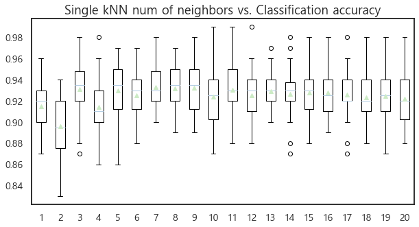
</p>

```python
plt.figure(figsize=(10, 5))
plt.title("Single kNN num of neighbors vs. Classification AUROC")
plt.boxplot(x=kNN_auroc_list, labels=kNN_k_list, showmeans=True);
```
<p align="center">
    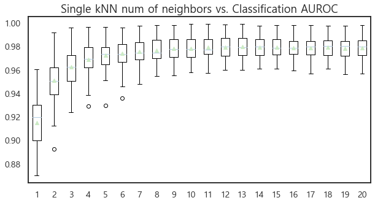
</p>

### <span style="color:maroon"> 2. Bagging with kNN
```python
plt.figure(figsize=(10, 5))
plt.title("Bagging kNN num of neighbors vs. Classification accuracy")
plt.boxplot(x=bag_kNN_acc_list, labels=bag_kNN_k_list, showmeans=True);
```
<p align="center">
    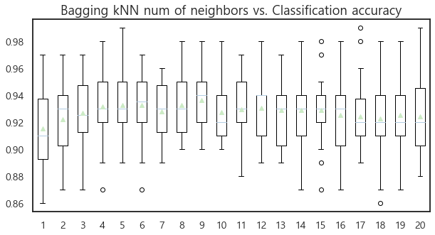
</p>

```python
plt.figure(figsize=(10, 5))
plt.title("Bagging kNN num of neighbors vs. Classification AUROC")
plt.boxplot(x=bag_kNN_auroc_list, labels=bag_kNN_k_list, showmeans=True);
```
<p align="center">
    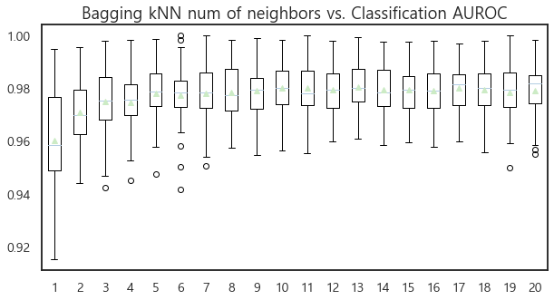
</p>

<br/>

### <span style="background-color:#fff5b1"> [실험 3] 결과 해석
- **<span style="color:maroon">Accuracy를 기준으로, Bagging을 보면, k값이 7보다 작을 때는 Accuracy가 증가하다가, k 값이 커질 수록 오히려 성능이 하락하거나 변동성이 큰 경향**을 시각적으로 볼 수 있었습니다.
    - **<span style="color:maroon">특히 k가 10을 넘어가면, 오히려 Single kNN에서 좀 더 안정된 성능을 확인**할 수 있습니다.
    - 이는 k값이 커질 수록 Variance가 작은 모델이 되기 때문입니다.
- **<span style="color:maroon">AUROC 기준으로는 Single kNN은 k가 7이 넘어가며 큰 값을 가질 수록 매우 높은 성능으로 수렴하는 모습**을 보이고 있습니다. 
    - 반면 **<span style="color:maroon">Bagging의 경우 초반에는 성능이 오르다가, 이후에는 성능이 약간 떨어지거나 들쭉날쭉한 경향**이 있습니다.
- 다시 말해, **<span style="color:maroon">k 값이 커지면 Bagging의 효과가 크게 나오지 않는 것**이죠. 이는 특히 AUROC에서 확실한 경향을 확인할 수 있습니다.
- **<span style="color:maroon">결론적으로, 이 데이터에서는 k=6~7 정도로 잡을 때 Bagging의 효과를 볼 수 있다고 결론** 지을 수 있습니다.

<br/>

# <span style="color:darkblue">Bagging 2: <span style="color:green">Random Forest 🌲🌳🌴

<p align="center">
    
</p>

<p align="center">
    <em>Random Forest: General Framework </em>
</p>
<p align="center">
    <em> Image source: https://ai-pool.com/a/s/random-forests-understanding </em>
</p>

Bagging 방법론을 기반으로 하는 대표적인 알고리즘은 Random Forest입니다. Decision Tree를 여러 개 모아 놓으면 숲이 되는데, 이 숲을 구성하는 방법을 Random으로 한다고 하여 "Random Forest"로 불리는 모델이죠.   

보다 구체적으로는 **여러 개의 Decision Tree를 생성한 뒤, 각 개별 Tree의 예측 값들 중 가장 많은 선택을 받은 변수들로 예측을 진행하는 방식으로 동작**합니다. Decision Tree의 중심 극한 정리 버전이라 할 수 있죠.   

이러한 방식의 장점은, **예측 값에 대한 Variance가 높다 하더라도, 이를 평균내서 분산을 줄일 수 있다는 것**입니다.   

그리고 각 Decision Tree마다 독립변수의 사용 개수를 제한하는데, 이때 Bagging 기법을 사용하는 것이 특징적이죠. Random Forest는 기본적으로는 Bagging의 방식을 따르기 때문에, **<span style="color:green">각 Decision Tree 마다 사용되는 데이터셋(Bootstrap)은 다르지만, Bagging처럼 모든 변수를 사용하는 대신에 Tree 별로 활용하는 독립변수를 다르게 하는 기법**입니다.   

이때 활용하는 독립변수의 수는 원래 변수의 수 $D$보다 적은 수의 변수를 사용하고, 보통 $\sqrt D$개를 사용합니다.

`Scikit-Learn`에서는 Classification Task에 있어 Random Forest를 간편하게 이용할 수 있도록, `RandomForestClassifier`를 제공하고 있습니다.
```python
from sklearn.ensemble import RandomForestClassifier
```

<br/>

## <span style="background-color:#fff5b1"> [실험 3] Bagging with Decision Tree vs. RandomForest
그렇다면 여기서 질문이 하나 생깁니다. **<span style="color:darkblue">Decision Tree를 Base Learner로 사용하는 Bagging 방식</span>과 <span style="color:green">Random Forest</span> 간의 성능 차이는 얼마나 날까요?**   

모든 변수를 사용하면 더 정보량이 많으니, Bagging이 더 높은 성능을 낼 수 있을까요? 아니면 다양한 입력 변수 조합에 대한 성능을 확인할 수 있으니, Random Forest의 성능이 더 좋게 나올까요? 이를 실험적으로 확인해 보겠습니다.
```python
# Random Forest
rf_clf = RandomForestClassifier(n_estimators=500, max_leaf_nodes=15, n_jobs=-1, random_state=2022)

# Bagging with Decision Tree
bag_clf_rf = BaggingClassifier(DecisionTreeClassifier(splitter="random", max_leaf_nodes=15, 
            random_state=2022), n_estimators=500, bootstrap=True, n_jobs=-1, random_state=2022)
```

- Bagging과 RandomForest 모두 Tree의 개수는 500개, max_leaf_nodes 15개로 동일한 조건을 주었습니다. 다만 다른 것은 사용하는 입력 변수의 개수가 다르겠죠.   

```python
# Evaluate Random Forest
acc_RF, acc_RF = evaluate_model(model=rf_clf, X=X, y=y)

# Evaluate Bagging with Decision Tree
acc_bag_DT, auroc_bag_DT = evaluate_model(model=bag_clf_rf, X=X, y=y)
```

### Results
- Random Forest: 0.88(0.03), 0.96(0.02)
- Bagging: 0.87(0.03), 0.95(0.02)

### <span style="background-color:#fff5b1"> [실험 3] 결과 해석
- Decision Tree를 기반으로 하는 Bagging보다는, **<span style="color:maroon">Random Forest의 성능이 더 우수한 것을 실험적으로 확인** 하였습니다. 둘의 차이는 Bootstrap 마다 활용하는 입력 변수의 개수였는데, **<span style="color:maroon">Random Forest는 서로 다른 입력 변수 조합을 활용한다는 특징**을 가지고 있었죠.
- 이로써 알 수 있는 것은, Ensembel Learning에 있어 **<span style="color:maroon">개별 모델의 다양성 확보**입니다. Ensemble Learnig에 있어 가장 중요한 핵심 아이디어는, 개별 모델의 "다양성"을 어떻게 확보할 것인가?에 기반하기 때문이죠. 동일한 모델을 여러 개 취합해봤자 큰 성능 향상이 없을 테니까요. 여기서 **<span style="color:maroon">"다양한 모델"이라 함은, 알고리즘이 다르거나, 동일 알고리즘이어도 데이터의 구성이나 하이퍼파라미터를 달리 하여 학습한 상황을 의미**합니다. (데이터 내의 노이즈가 서로 다르고, 하이퍼파라미터가 알고리즘의 구조에 영향을 주기 때문이죠.) 이러한 상황에서 개별 모델은 서로 적절하게 달라야 앙상블의 효과를 볼 수 있습니다.
- 따라서 Ensemble Learning의 효과를 보기 위해서는 **<span style="color:maroon">개별적으로는 어느 정도의 좋은 성능(Random Model보다는 좋은 성능)을 가지고, 앙상블 내에서 각각의 모델이 서로 다양한 형태를 나타내는 것이 가장 이상적**입니다.
- 그런데 **<span style="color:maroon">Bagging은 데이터는 다르지만 입력 변수가 모두 동일한 반면, Random Forest는 입력 변수가 모델 별로 모두 달라 다양성 측면에서 우수하다고 할 수 있죠. 이것이 바로 Random Forest가 단순 Decision Tree의 Bagging보다 더 좋은 성능을 내는 이유**라 할 수 있습니다.

<br/>

## <span style="background-color:#fff5b1"> [실험 4] Random Forest 사용 변수 개수 별 성능 차이가 있을까?
그러나 위 실험에서 Bagging과 Random Forest 간 성능 차이가 크지는 않았습니다. 그렇다면 이런 질문이 생길 수도 있습니다. **정말 Random Forest의 사용 변수 개수는 $\sqrt D$개이면 될까요?** 이것이 최적의 성능을 내는 것일까요?   
이런 물음을 가지고 [실험 4]에서는 Random Forest에서 Bootstrap마다 사용되는 입력변수의 수를 1부터 입력 변수의 개수만큼 늘려가며 성능을 비교해보았습니다.

```python
def get_RF():
    random_forest = dict()
    # Evaluate 'max_features' = from 1 to 20
    for i in range(1, 20+1):
        # Define Random Forest
        random_forest[str(i)] = RandomForestClassifier(n_estimators=500, n_jobs=-1, max_features=i, random_state=2022)
    return random_forest
```
```python
rf_clf_dict = get_RF()
```
```python
def print_results_per_max_features(models:dict, X, y):
    acc_score, auroc_score, n_feature_list = [], [], []
    for k, model in models.items():
        # Evaluate Random Forest
        acc, auroc = evaluate_model(model, X, y)
        # Store the Results
        acc_score.append(acc)
        auroc_score.append(auroc)
        n_feature_list.append(k)
        
        # Print the performance along the way
        print('n_feature=%s, Accuracy: %.3f (%.3f)' % (k, np.mean(acc), np.std(acc)))
        print('n_feature=%s, AUROC: %.3f (%.3f)' % (k, np.mean(auroc), np.std(auroc)))
        
    return acc_score, auroc_score, n_feature_list
```
```python
rf_acc_list, rf_auroc_list, rf_n_feature_list = print_results_per_max_features(rf_clf_dict, X, y)
```
```
Accuracy: 0.93 (0.03)
AUROC: 0.98 (0.01)
n_feature=1, Accuracy: 0.932 (0.027)
n_feature=1, AUROC: 0.983 (0.008)
Accuracy: 0.94 (0.02)
AUROC: 0.98 (0.01)
n_feature=2, Accuracy: 0.936 (0.023)
n_feature=2, AUROC: 0.984 (0.008)
...
Accuracy: 0.90 (0.03)
AUROC: 0.97 (0.01)
n_feature=20, Accuracy: 0.905 (0.032)
n_feature=20, AUROC: 0.970 (0.013)
```
```python
Best_Acc_idx = np.where([np.mean(acc) for acc in rf_acc_list] == np.max([np.mean(acc) for acc in rf_acc_list]))[0][0]+1
print('Best "max_features" is', Best_Acc_idx,
      'in terms of Accuracy:', '%.3f' % (np.mean(rf_acc_list[Best_Acc_idx-1])))
```
```
Best "max_features" is 2 in terms of Accuracy: 0.936
```
```python
Best_AUROC_idx = np.where([np.mean(auroc) for auroc in rf_auroc_list] == np.max([np.mean(auroc) for auroc in rf_auroc_list]))[0][0]+1
print('Best "max_features" is', Best_AUROC_idx,
      'in terms of AUROC:', '%.3f' % (np.mean(rf_auroc_list[Best_AUROC_idx-1])))
```
```
Best "max_features" is 3 in terms of AUROC: 0.985
```

### Result
```python
plt.figure(figsize=(10, 5))
plt.title("Random Forest num of features vs. Classification accuracy")
plt.boxplot(x=rf_acc_list, labels=rf_n_feature_list, showmeans=True);
```
<p align="center">
    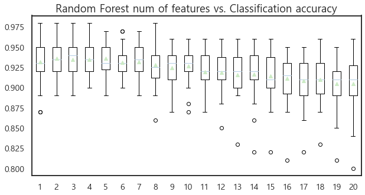
</p>

```python
plt.figure(figsize=(10, 5))
plt.title("Random Forest num of features vs. Classification AUROC")
plt.boxplot(x=rf_auroc_list, labels=rf_n_feature_list, showmeans=True);
```

<p align="center">
    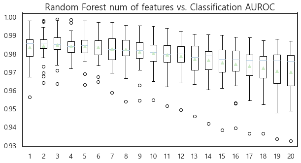
</p>

### <span style="background-color:#fff5b1"> [실험 4] 결과 해석
- 총 20개의 변수 중, Random Forest 내 Subset에서 몇 개의 변수를 입력 받을 것인지(`max_features`)에 따른 성능 변화를 Boxplot으로 확인해 보았습니다.
- 전체적인 경향을 확인해보니, **<span style="color:maroon">사용하는 변수의 수가 많아질 수록 오히려 성능이 하락하는 일반적인 경향을 Accuracy와 AUROC 관점에서 모두 확인**할 수 있었습니다.
- 특히 Acuuracy 기준에서는 입력 변수를 2개만 사용할 때, 그리고 AUROC 기준에서는 입력 변수를 오직 3개만 사용할 때 가장 좋은 성능을 보였습니다. 모두 $\sqrt D$ ($D=20 in this case$) 보다는 작은 값입니다.   
- 이렇게 **<span style="color:maroon">적은 변수만을 활용해도 좋은 성능이 나오는 이유는, [Dimensionality Reduction Tutorial](https://github.com/Im-JihyunKim/BusinessAnalytics_Topic1)때 다루었듯이, 활용하는 변수 차원이 늘어날 수록 차원의 저주에 빠져들기 쉽고, 또한 개별 모델의 다양성을 확보하기 용이** 다는 장점 때문입니다.

<br/>

-------

<br/>

# <span style="color:purple">Boosting 1: <span style="color:darkviolet">Gradient Boosting
<p align="center">
    
</p>

<p align="center">
    <em>Gradient Boosting: General Framework   </em>
</p>
<p align="center">
    <em> Image source: https://www.geeksforgeeks.org/ml-gradient-boosting/ </em>
</p>

Gradient Boosting은 대표적인 Boosting 계열 알고리즘으로서, XGBoost, LightGBM, CatBoost의 근간이 되는 알고리즘입니다. **<span style="color:darkviolet">학습의 전 단계에서 모델 별 잔여 오차(residual error)를 계산하고, 이 이 오차를 미분한 gradient를 통해 모델을 보완하는 방식**을 취합니다. 그렇기 때문에 "Gradient" Boosting이라는 이름이 붙었습니다.   

Gradient Boosting에서 사용되는 가장 핵심적인 방법은 **<span style="color:darkviolet">Gradient Descent, 즉 경사 하강법**입니다. Gradient Descent는 **<span style="color:darkviolet">Loss function을 정의하고, 이 미분값이 최소화되는 방향을 찾아나가는 방식**입니다. 만일 Loss Function을 Squared Error로 정의한다면, 아래와 같은 식으로 Loss와 Loss의 미분 값을 표현할 수 있겠죠.   

$$L(y_i, F(x_i)) = \frac{1}{2}(y_i - F(x_i))^2$$
$$\frac{\partial L(y_i, F(x_i))}{\partial F(x_i)} = y_i - F(x_i)$$

이때 편미분을 통해 얻은 gradient가 결국 $f(x)$가 Loss를 줄이기 위해 가야하는 방향인데, 이것이 결국 잔여 오차(residual error)와 같습니다. 이때 회귀 모형의 잔차는 Squared Loss Function의 Negative gradient $y_i-F(x_i)=-\frac{\partial L(y_i, F(x_i))}{\partial F(x_i)}$를 사용합니다.   

그렇다면 Gradient Boosting에서 사용되는 수식은 무엇일까요?   

$$train \ set: \begin{Bmatrix}
(x_i, y_i)
\end{Bmatrix}^N_{i=1} \quad loss \ funtion: L(y, F(x))$$
$$F_0(x) = arg \ \underset{\gamma }{min}\sum_{i=1}^{N}L(y_i, \gamma )$$

n개의 학습 데이터가 있을 때, Gradient Boosting에서는 초기 값으로 상수 함수를 활용합니다.  그리고 아래와 같이 pseudo-residual, 즉 gradient를 계산합니다. 이를 python으로 구현하면 아래와 같습니다.   

간단한 예시를 위해 MSE Loss를 최소화 하는 Regression Task를 푼다고 가정하겠습니다.
```python
from sklearn.datasets import make_regression
from sklearn.tree import DecisionTreeRegressor
```
```python
# Define dataset
X, y = make_regression(n_samples=100, n_features=1, random_state=2022)
```
임의의 Regression을 위한 가상 데이터셋을 만들고, 이를 Single Decision Tree에 학습시킵니다. max_depth를 2로 두어 Bias가 높은 Weak Learner를 사용합니다.

```python
F0 = np.mean(y)
print(F0)
```
```
-0.2068375978691931
```
첫 번째 Update는 먼저 $y$ 값의 평균으로 모형을 초기화합니다.
$$F_0(x) = -0.207$$

```python
# 1st residual error
r1 = y - F0

# First Single Decision Tree with 'max_depth' = 2
tree_1 = DecisionTreeRegressor(max_depth=2, random_state=2022, criterion='mse')
r1_fit = tree_1.fit(X, r1)
gamma1 = r1_fit.predict(X)
```
이후 첫 번째 residual error $r_1 = y-F_0(x)$를 구하고, 이 잔차에 max_depth=2인 Single Decision Tree를 학습시켜 잔차의 예측 값인 $\gamma$를 구합니다.
```python
print(f"Prediction of residual: {np.unique(gamma1)}")
```
```
Prediction of residual: [-42.66613158 -12.51579569  10.53423901  30.43568584]
```
Residual이 일종의 pseudo target value가 되는 것이죠.
```python
lr = 0.1
F1 = F0 + lr * gamma1 
```
이제 예측 값을 업데이트 해줍니다. 여기서 `lr`은 learning rate, 즉 gradient 계산에 있어 학습률을 의미합니다. `gamma1`은 첫 번째 잔차를 예측한 값, `F1`은 새로 예측된 $y$ 값을 의미합니다.
```python
print(f"1st Prediction: {F1}")
```
```
1st Prediction: [-1.45841717 -4.47345076 -4.47345076  0.8465863  -1.45841717  0.8465863
  2.83673099  2.83673099 -1.45841717 -1.45841717  0.8465863   0.8465863
 -1.45841717 -1.45841717  0.8465863   0.8465863   2.83673099  0.8465863
 -1.45841717  2.83673099  2.83673099  2.83673099  0.8465863   0.8465863
  2.83673099 -1.45841717  0.8465863  -4.47345076  2.83673099 -4.47345076
...
 -1.45841717 -1.45841717  0.8465863   0.8465863   2.83673099 -4.47345076
 -4.47345076  2.83673099  0.8465863   0.8465863  -1.45841717 -1.45841717
 -1.45841717  2.83673099  2.83673099  2.83673099]
```
예측 값을 보면 거의 동일한 값으로 예측을 하며, 그 성능이 형편 없음을 알 수 있습니다. Single Weak Learner로는 한 번만으로는 좋은 예측 서능을 내지 못하는 것이죠. 하지만 $T$번 만큼 학습을 반복한다면 어떻게 될까요? 위 과정을 $T$번 반복할 수 있는 함수는 아래와 같습니다.
```python
def GBM_Regression(X, y, T: int, lr):
    F_t = np.mean(y)
    tree = DecisionTreeRegressor(max_depth=2, random_state=2022)  # Weak Learner
    
    for t in range(1, T+1): # t=100
        print("Current update: ", str(t))
        F_before_t = F_t
        residual = y - F_before_t
        residual_fit = tree.fit(X, residual)
        gamma = residual_fit.predict(X)
        print(f"Prediction of Residual: {np.round(np.unique(gamma), 2)}")
        
        F_t = F_before_t + lr * gamma
        
        print(f"Prediction: {np.round(F_t, 2)}")
```
```python
GBM_Regression(X, y, T=100, lr=1e-2)
```
```
Current update:  1
Prediction of Residual: [-42.67 -12.52  10.53  30.44]
Prediction: [-0.33 -0.63 -0.63 -0.1  -0.33 -0.1   0.1   0.1  -0.33 -0.33 -0.1  -0.1
 -0.33 -0.33 -0.1  -0.1   0.1  -0.1  -0.33  0.1   0.1   0.1  -0.1  -0.1
  0.1  -0.33 -0.1  -0.63  0.1  -0.63 -0.33 -0.1  -0.33 -0.33 -0.33  0.1
 -0.1  -0.33 -0.63 -0.1  -0.33 -0.33 -0.33 -0.1  -0.1  -0.33 -0.33 -0.1
 -0.1   0.1  -0.63 -0.1  -0.33  0.1  -0.33 -0.1   0.1  -0.1  -0.63 -0.33
 -0.33 -0.33 -0.63 -0.63  0.1  -0.33 -0.1  -0.33 -0.1   0.1  -0.33  0.1
 -0.1  -0.1  -0.33 -0.33  0.1  -0.33 -0.63 -0.33 -0.33  0.1  -0.33 -0.1
 -0.33 -0.33 -0.1  -0.1   0.1  -0.63 -0.63  0.1  -0.1  -0.1  -0.33 -0.33
 -0.33  0.1   0.1   0.1 ]
Current update:  2
Prediction of Residual: [-43.55 -13.47   8.68  28.84]
Prediction: [-0.47 -1.07 -1.07 -0.01 -0.47 -0.01  0.39  0.39 -0.47 -0.47 -0.01 -0.01
 -0.47 -0.47 -0.01 -0.01  0.39 -0.01 -0.47  0.39  0.39  0.39 -0.01 -0.01
  0.39 -0.47 -0.01 -1.07  0.39 -1.07 -0.47 -0.01 -0.47 -0.47 -0.47  0.39
 -0.01 -0.47 -1.07  0.19 -0.47 -0.47 -0.25 -0.01 -0.01 -0.47 -0.47 -0.01
 -0.01  0.39 -0.77  0.19 -0.47  0.39 -0.47 -0.01  0.39 -0.01 -1.07 -0.47
 -0.47 -0.47 -1.07 -1.07  0.39 -0.47 -0.01 -0.47 -0.01  0.39 -0.47  0.39
 -0.01 -0.01 -0.47 -0.47  0.39 -0.47 -1.07 -0.47 -0.25  0.39 -0.47 -0.01
 -0.47 -0.47 -0.01 -0.01  0.39 -1.07 -1.07  0.39  0.19 -0.01 -0.47 -0.47
 -0.47  0.39  0.39  0.39]

 ...

Current update:  100
Prediction of Residual: [-18.42  -4.15   6.89  25.6 ]
Prediction: [-2.060e+00 -2.353e+01 -2.353e+01  6.080e+00 -1.040e+01  8.420e+00
  2.618e+01  1.555e+01 -9.810e+00 -1.170e+01 -2.000e-02  6.080e+00
 -7.800e+00 -1.040e+01  3.670e+00  6.080e+00  1.526e+01  4.160e+00
 -1.442e+01  1.479e+01  2.618e+01  1.622e+01  6.080e+00  1.029e+01
  1.622e+01 -1.442e+01  7.360e+00 -2.353e+01  1.555e+01 -2.336e+01
 -7.020e+00  2.880e+00 -1.040e+01 -8.390e+00 -1.544e+01  1.375e+01
  6.080e+00 -1.930e+00 -2.452e+01  1.244e+01 -2.060e+00 -1.626e+01
 -6.500e-01  3.700e-01  9.830e+00 -4.140e+00 -1.301e+01  1.960e+00
  6.080e+00  1.622e+01 -1.740e+01  1.244e+01 -3.790e+00  1.479e+01
 -4.840e+00  6.080e+00  1.526e+01  9.830e+00 -3.320e+01 -3.790e+00
 -1.205e+01 -6.080e+00 -2.883e+01 -2.374e+01  1.555e+01 -5.360e+00
  8.580e+00 -2.480e+00  9.370e+00  1.526e+01 -2.060e+00  2.618e+01
  6.080e+00  8.580e+00 -2.200e+00 -1.442e+01  1.622e+01 -1.040e+01
 -3.320e+01 -1.110e+01 -8.300e-01  1.555e+01 -1.780e+00  6.080e+00
 -1.170e+01 -1.442e+01  9.830e+00  6.080e+00  1.685e+01 -2.353e+01
 -2.452e+01  2.618e+01  1.244e+01  6.080e+00 -8.840e+00 -1.040e+01
 -1.222e+01  1.339e+01  1.555e+01  1.526e+01]
```
초반의 Update 값은 잔차도 매우 크고, 예측 값도 일정한 수준으로 밀어버리지만, 100번 가량의 Update 후에는 잔차 값이 상대적으로 낮아졌으며, data point 하나하나에 대한 실제 prediction 값을 내뱉는 경향이 강해집니다.

$$g_{im} = \begin{bmatrix}
\frac {\partial L(y_i, f(x_i))}{\partial f(x_i)}
\end{bmatrix}_{f(x_i) = f_{m-1}(x_i)}$$
<br/>

위에서 본 과정과 같이, **<span style="color:darkviolet">Gradient Boosting은 학습 데이터에 y 대신 gradient를 적용하고(target에 pseudo residual을 적용하는 것이죠), Loss function에 넣으면서 계속해서 잔차를 줄이는 방식**을 택합니다.   

<br/>

$$h_t(x): base \ model(tree) \quad train \ set: \begin{Bmatrix}
(x_i, g_{im}) \\
\end{Bmatrix}^N_{i=1} \\ 
F_t(x) = F_{t-1}(x) + \alpha h_t(x)$$

따라서 **<span style="color:darkviolet">처음 $F_0(x)$는 상수함수였지만 (In this case, $F_0 = mean\ of\ y\ values$), 현재 시점 t에 대한 모델 $h_t(x)$가 들어가며 gradient를 고려한 학습이 가능**케 되었죠. 참고로 $\alpha$는 Learning rate (lr) 입니다. 예제처럼 직접 넣거나 최적화 식을 넣어 사용하기도 합니다.   

이 과정을 python을 통해 시각화하자면 아래와 같습니다.
```python
# First Update
F0 = np.mean(y)
r1 = y - F0

# Second Update
tree_1 = DecisionTreeRegressor(max_depth=2, random_state=2022, criterion='mse')
tree_1.fit(X, r1)

# Third Update
y2 = y - tree_1.predict(X)  # residual errors

tree_2 = DecisionTreeRegressor(max_depth=2, random_state=2022, criterion='mse')
tree_2.fit(X, y2)

# Final Update
y3 = y2 - tree_2.predict(X)

tree_3 = DecisionTreeRegressor(max_depth=2, random_state=2022)
tree_3.fit(X, y3)

# Prediction
y_pred = sum(tree.predict(X_test) for tree in (tree_1, tree_2, tree_3))
```
```python
def plot_predictions(regressors, X, y, axes, label=None, style="r-", data_style="b.", data_label=None):
    x1 = np.linspace(axes[0], axes[1], 500)
    y_pred = sum(regressor.predict(x1.reshape(-1, 1)) for regressor in regressors)
    plt.plot(X[:, 0], y, data_style, label=data_label)
    plt.plot(x1, y_pred, style, linewidth=2, label=label)
    if label or data_label:
        plt.legend(loc="upper center", fontsize=16)
    plt.axis(axes)
```
```python
plt.figure(figsize=(11,11))

axes = [X.min()-1, X.max()+1, y.min()-1, y.max()+1]

plt.subplot(321)
plot_predictions([tree_1], X, y, axes=axes, label="$h_1(x_1)$", style="g-", data_label="Train Data")
plt.ylabel("$y$", fontsize=12, rotation=0)
plt.title("Residual Error & Prediction of Single DT", fontsize=16)

plt.subplot(322)
plot_predictions([tree_1], X, y, axes=axes, label="$h(x_1) = h_1(x_1)$", data_label="Train Data")
plt.ylabel("$y$", fontsize=12, rotation=0)
plt.title("Prediction of Ensemble", fontsize=16)

plt.subplot(323)
plot_predictions([tree_2], X, y2, axes=axes, label="$h_2(x_1)$", style="g-", data_style="k+", data_label="Residual Error")
plt.ylabel("$y - h_1(x_1)$", fontsize=16)

plt.subplot(324)
plot_predictions([tree_1, tree_2], X, y, axes=axes, label="$h(x_1) = h_1(x_1) + h_2(x_1)$")
plt.ylabel("$y$", fontsize=12, rotation=0)

plt.subplot(325)
plot_predictions([tree_3], X, y3, axes=axes, label="$h_3(x_1)$", style="g-", data_style="k+")
plt.ylabel("$y - h_1(x_1) - h_2(x_1)$", fontsize=12)
plt.xlabel("$x_1$", fontsize=12)

plt.subplot(326)
plot_predictions([tree_1, tree_2, tree_3], X, y, axes=axes, label="$h(x_1) = h_1(x_1) + h_2(x_1) + h_3(x_1)$")
plt.xlabel("$x_1$", fontsize=12)
plt.ylabel("$y$", fontsize=12, rotation=0)

plt.show()
```
<p align="center">
    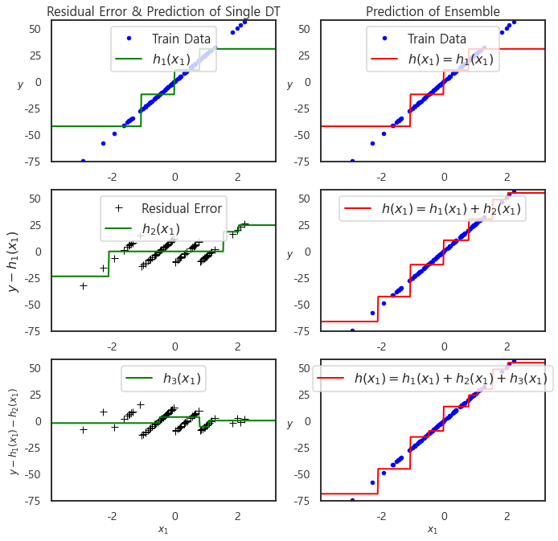
</p>

시각화 결과를 보면, 시점이 1에서 3으로 증가할 수록 Graident Boosting Model의 예측 값이 점점 실제 데이터에 잘 fitting되는 것을 확인할 수 있습니다.

**<span style="color:darkviolet">정리하자면 Gradient Boosting의 학습 방식은 다음과 같습니다.**   
1. 초기 값으로 상수 함수 적용
2. Loss function을 최소화 하는 gradient를 구함
3. Gradient를 $h^t$의 target으로 사용하여 gradient를 고려한 학습 진행
4. 적절한 Learning rate $\alpha$를 고려한 최종 모형 생성
5. 2~4 과정 반복

<br/>

## <span style="background-color:#fff5b1"> [실험 6] Learning Rate에 따른 Gradient Boosting의 성능 변화
이때 학습 방식에서 **<span style="color:maroon">"적절한 Learning rate"를 설정하는 기준은 무엇일까요?** 예제에서는 임의로 1e-2 값을 사용하였으나, **<span style="color:maroon">Loss를 최소화 하는 gradient를 찾기 위해서는 learning rate 값을 잘 설정해주는 것이 매우 중요해보입니다.** 이를 실험으로 확인해보겠습니다.   
```python
from sklearn.ensemble import GradientBoostingClassifier
```
```python
# Get a list of models to evaluate
def get_models():
    models = dict()
    # Define learning rates to explore
    for i in [1e-4, 1e-3, 1e-2, 1e-1, 1e-0]:
        lr = '%.4f' % i
        models[lr] = GradientBoostingClassifier(learning_rate=i)
    return models


def print_results_per_lr(models:dict, X, y):
    acc_score, auroc_score, lr_list = [], [], []
    for k, model in models.items():
        # Evaluate Gradient Boosting Ensemble Models per learning rate
        acc, auroc = evaluate_model(model, X, y)
        # Store the Results
        acc_score.append(acc)
        auroc_score.append(auroc)
        lr_list.append(k)
        
        # Print the performance along the way
        print('lr=%s' % (k))
        
    return acc_score, auroc_score, lr_list
```
```python
# Define Dataset
X, y = get_dataset()

# Define Models
GBM = get_models()

# Evaluate Models
gbm_acc, gbm_auroc, gbm_lr = print_results_per_lr(GBM, X, y)
```

### Results
```
Accuracy: 0.74 (0.05)   
AUROC: 0.80 (0.05)   
lr=0.0001    

Accuracy: 0.75 (0.05)    
AUROC: 0.82 (0.05)    
lr=0.0010   

Accuracy: 0.81 (0.04)   
AUROC: 0.90 (0.03)   
lr=0.0100   

Accuracy: 0.91 (0.02)   
AUROC: 0.97 (0.01)   
lr=0.1000   

Accuracy: 0.92 (0.02)   
AUROC: 0.97 (0.01)   
lr=1.0000   
```
<br/>

## <span style="background-color:#fff5b1"> [실험 6] 결과 해석
```python
plt.figure(figsize=(10, 5))
plt.title("Gradient Boosting Learning Rate vs. Classification Accuracy")
plt.boxplot(gbm_acc, labels=gbm_lr, showmeans=True);
```

<p align="center">
    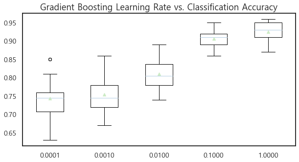
</p>

```python
plt.figure(figsize=(10, 5))
plt.title("Gradient Boosting Learning Rate vs. Classification AUROC")
plt.boxplot(gbm_auroc, labels=gbm_lr, showmeans=True);
```

<p align="center">
    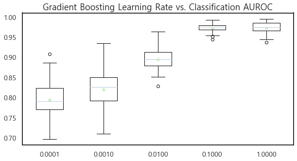
</p>

- 결과를 시각화한 Plot을 보면, **<span style="color:maroon">Learning Rate가 올라갈 수록 Gradient Boosting의 성능이 향상하는 경향을 확인**할 수 있습니다.
- 이는 **<span style="color:maroon">Learning Rate가 높을 수록 빠르게 모델의 Bias를 줄여나가기 때문**입니다. 그렇다면 learning rate은 높을 수록 무조건 좋은 것일까요? 그렇지는 않습니다.
- 사실 **<span style="color:maroon">일반적으로는 1e-3(0.001) ~ 1e-2(0.01) 수준의 낮은 값을 설정하는 것이 보통**입니다. 그 이유는 **작은 값으로 설정하여야 세밀한 Model을 얻을 수 있기 때문**입니다. **<span style="color:maroon">Learning Rate가 높으면 빠르게 모델의 Bias를 줄일 수 있는 한편 Fitting 과정에서 detail한 부분을 놓칠 수 있다는 Trade-off를 감안**해야 하는 것입니다.

<br/>

# <span style="color:purple">Boosting 2: <span style="color:crimson">CatBoost 😻
CatBoost는 "Gradient Boosting with Categorical Features Suppeort", 즉, 설명 변수에 Category 타입의 데이터가 포함되어 있을 때 유용하게 사용되는 Gradient Boosting 계열 방법론입니다. CatBoost의 저자들은 기존의 Gradient Boosting 모델의 문제점을 짚으면서 논문의 서론을 시작하는데, 모델을 순차적으로 업데이트 하는 데 있어 **Greedy Manner**를 이용한다는 문제를 지적합니다. 이것이 **<span style="color:crimson">Inference에서 활용되어야 할 데이터를 Train 단계에서 이용하고 있다는 문제를 지적**한 것이죠.   

앞서 Gradient Boosting에서 t번째 Boosting 모형 $F_t$를 만들 때에는, t-1번째까지 누적된 모형 $F_{t-1}$에 현재 시점의 모형 $h_t$를 더해주는 방식을 이용한다고 하였습니다. 따라서 아래와 같이 t 시점의 Boosting 모형을 구할 수 있는 것이죠. 
$$F_t(x) = F_{t-1}(x) + \alpha h_t(x)$$
이때 $h_t$는, t-1 시점까지의 누적 모델 $F_{t-1}$에 $h_t$를 더하였을 때 추정되는 예측 값을 실제 값과 비교했을 때 그 Loss가 최소화 되는 함수를 찾습니다. 이는 아래와 같은 식으로 나타낼 수 있습니다.
$$h_t = arg\ \underset{h \in H}{min}\mathcal{L}(F_{t-1}+h) = arg \ \underset {h \in H}{min} \ \mathbb{E}L(y)F_{t-1}(x)+h(x)$$   

이때 $h_t$를 근사하는 데는, t 시점에서의 gradient의 반대 방향으로 이를 추정합니다. 주로 Least Square Approximation을 사용하는데, 이는 아래와 같습니다.

$$h_t = arg \ \underset{h\in H}{min} \ \mathbb{E}(-g_t(x, y)-h(x))^2 \\
g_t(x, y) := \frac{\partial L(y,s)}{\partial F_{t-1}(x)}$$

다시 말해, negative gradient = $-g_t(x, y)$에서 현재 h(x)라는 함수를 추정했을 때, 그 차이에 대한 Expectation이 최소화 되는 t번째 시점에서의 tree 모형을 만드는 것이 Gradient Boosting 모형이죠.   

이에 CaBoost의 저자들은, **<span style="color:crimson">기본적인 Gradient Boosting 계열의 방법론들이 가지는 2가지 문제를 제기**합니다.  

## Problems of Gradient Boosting 1: <span style="color:crimson">Prediction Shift
먼저 $h_t$를 추정하는 데 있어, 모든 데이터셋에 대한 기댓값을 최소화 하는 것은 유한한 관측치 개수를 가지는 데이터에서는 불가능한 일입니다. 따라서 아래와 같이 Training Dataset에 대한 평균척 차이로 근사하게 되죠.  
    
$$h_t = arg \underset{h \in H}{min}\mathbb{E}(-g_t(x, y)-h(x))^2 \approx \frac{1}{n}\sum^{n}{k=1}(-g_t(x,y)-h(x))^2 \\  Training \ Dataset: \mathcal{D}=(x_k, y_k)_{k=1,...,n} \ where \ x_k=(x^1_k, ..., x^m_k), \quad y_k \in \mathbb{R}$$
    
바로 이러한 지점에서, 학습 데이터에서 $x_k$가 주어졌을 때, 지금까지 우리가 만들었던 누적된 Boosting 모형의 값과 Test Example $x$가 주어졌을 때 누적된 Boosting 모형의 값이 다르다는 문제가 발생합니다. 다시 말해, **<span style="color:crimson">train example $x_k$가 주어졌을 때의 gradient와, $x$가 주어졌을 때의 test example에서의 gradient의 conditional distribution이 다른 것**입니다.   
$$F_{t-1}(x_k)|x_k ≠ F_{t-1}(x)|x$$
이 두 가지가 같아야 모델링의 정합성이 확보 되는데, 학습 데이터에 대한 누적 함수의 조건부 확률과 검증용 데이터에 대한 조건부 확률이 다른 것이 바로 첫 번째 Issue입니다. 이를 Prediction Shift라 하고, 이렇게 **<span style="color:crimson">편향된 $h_t$를 $F_t$를 만드는 데 사용하면, 결국 $F_t$의 일반화 성능이 문제가 된다는 점을 짚은 것이죠. 실제로 Gradient Boosting 모델은 Overfitting의 문제**를 안고 있습니다.   

<br/>

## <span style="color:crimson">Solution 1: Ordered Boosting
이를 해결하기 위해 CatBoost에서 제안한 방법이 바로 **<span style="color:crimson">Ordered Boosting**입니다. 'Ordered'라는 말이 들어간 이유는, 변수에 대해 무작위 permutation를 수행하여 순열을 만들고, 순차적으로 잔차를 계산하며 tree를 학습시키기 때문입니다.   

만일 9개의 변수가 있다고 가정하자면, 방법론을 아래와 같이 도식화 할 수 있습니다.   
<p align="center">
    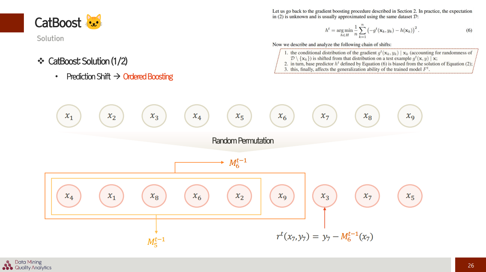
</p>

$M_5^{t-1}$은 5번째 데이터까지만을 사용해 만들어낸 모델이고, $M_6^{t-1}$은 6번째 데이터까지만을 사용해 만들어낸 모델이겠죠. <span style="color:crimson">중요한 것은 **<span style="color:crimson">7번째 데이터에 대해 잔차(residual)를 구할 때, $M_7^{t-1}$를 이용하는 것이 아니라, $M_6^{t-1}$를 이용해야 한다는 것**</span>입니다. 왜 그럴까요? **<span style="color:crimson">$M_6^{t-1}$를 만들 때 7번째 데이터, $x_3$은 한 번도 사용된 적이 없죠. 그렇기에 inference 때와 동일한 환경을 조성**할 수 있다는 것입니다. 이를 통해서 Prediction Shift 문제를 해결하고 있습니다.   

<br/>

## <span style="background-color:#fff5b1"> [실험 7] CatBoost vs. Gradient Boosting: in terms of performance
사실 Ensemble Learning은 여러 모델의 예측 값을 합치는 취합하는 방식이기 때문에, Single Model보다는 Overfitting을 방지할 수 있는 가능성이 높습니다. 그럼에도 Deisicion Tree를 기반으로 하는 알고리즘의 경우에는 여전히 Overfitting의 문제를 피해가기 힘들며, Gradient Boosting 계열 모델들의 경우 앞선 이유에서 과적합의 경향을 보이고 있스니다.   

**<span style="color:maroon">CatBoost는 정말 GBM과는 다르게 Overfitting을 완화하였을까요? 그렇다면 Test 결과 CatBoost의 성능이 더 높을 것입니다.** CatBoost의 기본적 성능을 실험으로 확인해보겠습니다.   

```python
from catboost import CatBoostClassifier
```
```python
# Define Dataset
X, y = get_dataset()

# Gradient Boosting Classifier
gbm_clf = GradientBoostingClassifier(random_state=2022, learning_rate=1e-2)

# CatBoost Classifier
cat_clf = CatBoostClassifier(random_seed=2022, learning_rate=1e-2)
```
- GBM과 CatBoost는 동일한 Hyperparameter를 사용하며, learning_rate는 1e-2로 일반적으로 자주 사용되는 작은 값을 임의로 설정해줍니다. learning rate가 1e-2인 이유는 **<span style="background-color:#fff5b1">[실험 6]** 에서 확인하였습니다.   

```python
# Evaluate GBM
acc_gbm, auroc_gbm = evaluate_model(model=gbm_clf, X=X, y=y)

# Evaluate CatBoost
acc_cat, auroc_cat = evaluate_model(model=cat_clf, X=X, y=y)
```

### Results
|                       | __Gradient Boosting__| __CatBoost__ |
|:---------------------:|:--------------------:|:------------:|
|__Mean Accuracy (std)__| 0.81 (0.04)          | **0.95 (0.02)**  |
|   __Mean AUROC (std)__|   0.90 (0.03)        |  **0.99 (0.01)** |

<br/>

### <span style="background-color:#fff5b1"> [실험 7] 결과 해석
- 실험 결과, **<span style="color:maroon">CatBoost가 괄목할 만한 성능을 내며, 성능 측면에서 우수성을 입증**하였습니다. Accuracy 측면에서 14%, AUROC 측면에서는 9% 가량 높은 성능을 기록한 것입니다.
- 더불어 **<span style="color:maroon">모델들의 예측 값 편차도 Auuracy와 AUROC 측면에서 모두 더 낮은 값을 기록하며, Bias뿐 아니라 Variance를 낮춘 이상적인 모델로서 성능을 입증**했습니다.
- 이는 Inference 시 활용되어야 할 데이터를 학습 시 모델 업데이트 과정에서 지속적으로 사용했던 Gradient Boosting과는 다르게, **<span style="color:maroon">CatBoost에서는 t 시점의 잔차를 계산하는 과정에서 t-1 시점의 누적 Boosting 모형을 활용하면서, Inference 때와 동일한 환경을 조성하였기 때문입니다. 즉, Generalization 성능이 확보**된 것이죠.

<br/>

## <span style="background-color:#fff5b1"> [실험 8] CatBoost vs. Gradient Boosting: in terms of training time
앞서 CatBoost는 random permutation을 학습 과정마다 실시하고 순차적으로 residual을 계산하며 지속적인 update를 수행한다고 하였습니다. 이로써 Overfitting을 방지하고 Testing 성능을 높일 수 있지만, **<span style="color:maroon">학습 시 소요 시간이 매우 오래 걸리지는 않을까요?** 이를 직접 실험을 통해 비교해보겠습니다.   

```python
def evaluate_model_time(model, X, y, task: str):
    training_time = dict()
    
    start = time.time()
    
    # Define the evaluation procedure
    cv = RepeatedStratifiedKFold(n_splits=10, n_repeats=3, random_state=2022)
    # Evaluate model and collect the results
    acc = cross_val_score(model, X, y, scoring='accuracy', cv=cv, n_jobs=-1)
    roc_auc = cross_val_score(model, X, y, scoring='roc_auc', cv=cv, n_jobs=-1)
    training_time[task] = np.round(time.time() - start, 3)
    
    # Report Performance
    print("Accuracy: %.2f (%.2f)" % (np.mean(acc), np.std(acc)))
    print("AUROC: %.2f (%.2f)" % (np.mean(roc_auc), np.std(roc_auc)))
    
    # Report Training Time
    print(f"Training Time: {training_time[task]}s")
    
    return acc, roc_auc
```
```python
acc_gbm, auroc_gbm = evaluate_model_time(model=gbm_clf, X=X, y=y, task="Gradient Boosting")

acc_cat, auroc_cat = evaluate_model_time(model=cat_clf, X=X, y=y, task="CatBoost")
```

### Results
|                       | __Gradient Boosting__| __CatBoost__ |
|:---------------------:|:--------------------:|:------------:|
| __Training Time__     |  **2.192 sec**           |   73.247 sec   |
|__Mean Accuracy (std)__| 0.81 (0.04)          | **0.95 (0.02)**  |
|   __Mean AUROC (std)__|   0.90 (0.03)        |  **0.99 (0.01**) |

<br/>

### <span style="background-color:#fff5b1"> [실험 8] 결과 해석
- 실험 결과 **<span style="color:maroon">CatBoost의 학습 시간이 약 33% 이상 오래 걸린 것을 확인**하였습니다. 
- 이는 앞서 언급한 바와 같이 **<span style="color:maroon">CatBoost가 학습 단계마다 Random Permutation을 수행 후 순차적으로 잔차를 계산하는 학습 방식을 통해 모델을 업데이트하기 때문**입니다.
- 즉, CatBoost는 성능은 높지만 학습 시간이 매우 오래 걸리기에, 둘 사이의 Trade Off를 고려해야 하는 모델입니다.


<br/>

## Problems of Gradient Boosting 2: <span style="color:crimson">Target Leakage (in Target Statistics)   
> **Target Statistics (TS)**   
> Categorical 변수들을 Numerical Value로 바꾸는 방법론입니다. 일반적으로 가장 범용적으로 사용되는 것은 Mean-Encoding/Target-Encoding이라 불리는 방법론으로, 학습 데이터셋의 **Categorical Features를 Target Value의 평균으로 대체**하는 방법론을 일컫습니다.   

기존 Gradient Boosting 모델의 두 번째 이슈는 Target Leakage입니다. **<span style="color:crimson">학습 데이터의 Target(정답) 정보를 입력 변수, 즉 객체의 속성을 정의하는 데 이미 사용되고 있다는 문제를 제기**한 것입니다. 원래 머신러닝의 목적은 입력 변수 $x$가 주어졌을 때 $y$를 추정할 수 있는 함수 $f(\cdot)$를 찾는 것이죠. 그런데 일반적인 Boositng에서의 Target Statistics 방식에서는 실제 $y$ 값이 $\hat y$을 계산하는 데 사용되고 있다는 문제가 있습니다. 즉, $x$로 $y$를 추정한다는 기본 가정을 위배한 채 target 정보가 새어나가고 있다는 것이죠.  

따라서 CatBoost의 저자들은 **Target Statistics에서 필요한 바람직한 속성**에 대하여 질문을 던지고, 나름의 2가지 속성을 제안합니다.
$$Property\ 1 \quad \mathbb{E}(\hat x^i | y=v) = \mathbb{E}(\hat x^i_k | y_k=v), where \ (x_k, y_k) \ is \ the \ k-th \ training \ example.$$
$$Property\ 2 \quad Effective\ usage\ of\ all\ training\ data\ for\ calculating\ TS\ features\ and\ for\ learning\ a\ model$$   

**Property 1**은 $y$가 $v$라는 값을 가질 때, $i$번째 속성에 해당하는 Expectation과, k번째 training example에 대해서 $y_k$가 $v$일 때의 Expectation이 같아야 한다는 의미입니다. 쉽게 말해, **$y$가 $v$라는 값을 가질 때 Train 데이터와 Test 데이터에 대해서 Target Statistics의 기댓값이 모두 동일해야 한다는 것**입니다.   

<br/>

**Property 2**는 가급적이면 **Target Statistics를 계산하는 데 있어 모든 Dataset을 효과적으로 사용하라는 의미**입니다. 결국 가능한 많은 학습 데이터를 사용해서 TS를 계산하라는 것이죠.

<br/>

## <span style="color:crimson">Solution 2: Ordered Target Statistics
위와 같은 속성을 만족시키기 위해서, 저자들이 제안한 Solution이 바로 Ordered Target Statistics입니다. 여기서 'Ordered'라 함은, 앞서 언급한 것과 마찬가지로, **<span style="color:crimson">객체를 무작위로 permutation 시킨 후, Artificial Time, 즉 가상의 시간 개념을 부여하기 때문**입니다. 이때 Ordered Boosting과 마찬가지로, **$x_k$에 대한 TS를 계산할 때는 $x_k$의 이전 정보만을 활용**합니다. 그렇다면 TS를 위해 필요한 subset $\mathcal{D_k}$는 아래와 같이 표기되겠죠.
    
$$\mathcal{D}_k \subset \mathcal{D} \ \backslash \begin{Bmatrix}
x_k
\end{Bmatrix} \ excluding \ x_k$$

$$
\mathcal{D}_k = \begin{Bmatrix}
x_j : \sigma (j) < \sigma (k)
\end{Bmatrix}
$$

                       
여기서 $\sigma$는 random permutation을 의미하는 parameter입니다. 이를 바탕으로 Categorical 변수 $x^i$에서 k번째 객체 $x^i_k$는 다음과 같이 구할 수 있습니다.   
$$\hat{x}^i_k = \frac{\sum_{x_j \in \mathcal{D}_k} \mathbb{1} \begin{Bmatrix} x^i_j = x^i_k \end{Bmatrix} \cdot y_j + ap}{\sum{x_j \in \mathcal{D}_k} \mathbb{1} \begin{Bmatrix} x^i_j = x^i_k \end{Bmatrix} + a}$$

- 먼저 분자와 분모에 공통적으로 들어간 term인 $\sum_{x_j \in \mathcal{D}_k}\mathbb{1}\begin{Bmatrix} x^i_j = x^i_k \end{Bmatirx}$는 무슨 의미일까요? **k번째 관측치 $x_k$ 직전까지의 모든 데이터에 대하여, $x_k$와 동일한 카테고리 값을 가지는 관측치의 개수를 의미**합니다.
                         
- $\sum_{x_j \in \mathcal{D}_k}\mathbb{1}\begin{Bmatrix} x^i_j = x^i_k \end{Bmatirx} \cdot y_j$는, **k번째 관측치 직전까지의 모든 데이터에 대하여, $x_k$와 동일한 카테고리 값을 가지는 관측치의 Target 값**을 의미하겠죠.
- 이때 **$a$는 Permutation에 대한 Hyperparameter**이고, Ordered Boosting에서도 함께 사용되는 값입니다.
- p는 **k번째 관측치 직전까지의 모든 데이터에 대하여, 특정 Target이 나타날 선행 확률**을 의미합니다.

<br/>

## <span style="background-color:#fff5b1">  [실험 9] Mean Target Encoding vs. Ordered Target Statistics
CatBoost는 이름에서도 알 수 있듯이 Categorical 변수를 다룸에 있어 최적화된 알고리즘입니다. 이때 앞서 언급한 Target Mean 방식은 Target Leakage 문제로 인한 Overfitting 현상이 일어난다고 짚은 바 있습니다. 따라서 CatBoost는 Ordered TS를 통해 Target Leakage를 해결하고자 합니다.   

이때 본 튜토리얼에서는 **<span style="color:maroon">Binary Classification Task에 있어, Ordered Target Statistics와 Target Mean Encoding 모두 직접 Scratch로 구현해보고 결과를 비교**해보고자 합니다.   

활용하는 데이터셋은 titanic dataset 일부이며, Categorical 변수를 다루기 위해 'Embarked' Column만을 활용합니다. **<span style="color:maroon"> 본 튜토리얼의 목적**은 titanic 데이터셋에서 높은 분류 성능을 달성하기 위한 분석이 아니라, **<span style="color:maroon"> Categorical 변수 처리 방식을 비교하기 위함**이기 때문입니다.

```python
from catboost.datasets import titanic

# Loade Dataset
df, _ = titanic()
df = df[['Embarked', 'Survived']].dropna().reset_index(drop=True)

# Split Dataset into train/valid/test
train_idx, test_idx = train_test_split(np.arange(df.shape[0]), train_size=.8, random_state=2022)

df_train = df.iloc[train_idx].reset_index(drop=True)
df_test = df.iloc[test_idx].reset_index(drop=True)
```
- 활용하는 데이터셋은 titanic dataset 일부이며, Categorical 변수를 다루기 위해 'Embarked' Column만을 활용합니다. **본 튜토리얼의 목적**은 titanic 데이터셋에서 높은 분류 성능을 달성하기 위한 분석이 아니라, **Categorical 변수 처리 방식을 비교하기 위함**이기 때문입니다.
- y는 'Survived'이며, 생존 여부를 구분하는 Binary Classification Task입니다.
- 이때 본 튜토리얼에서는 **Binary class를 가지는 Target의 정보를 활용하여 Target Statistics 값을 만드는 방법을 직접 구현**해볼 것입니다.


### <span style="color:maroon">1. Target Mean Encoding
```python
def Mean_TS_for_binary_clf(df: pd.DataFrame, X_col: str, y_col:str):
    Mean_TS_encode = df[y_col].groupby(df[X_col]).agg(['mean'])['mean']
    
    df.loc[:, 'TS'] = df[X_col].map(Mean_TS_encode)
    
    return df
```
- Binary Classification Task를 풀고자 할 때, Target Mean Encoding 방식은 위와 같이 구현될 것입니다.

#### <span style="color:maroon"> Target Mean Encoding: TS in Train Data
```python
df_train_TS = Mean_TS_for_binary_clf(df=df_train, X_col='Embarked', y_col='Survived')
df_train_TS
```
```
    Embarked	Survived	TS
761	    C	        1	0.550725
546	    C	        1	0.550725
450	    S	        0	0.349421
135	    S	        1	0.349421
58	    S	        1	0.349421
...	    ...	       ...	    ...
240	    Q	        1	0.327273
689	    S	        1	0.349421
624	    S	        0	0.349421
173	    C	        0	0.550725
220	    S	        0	0.349421
```
```python
df_test_TS = Mean_TS_for_binary_clf(df=df_test, X_col='Embarked', y_col='Survived')
df_test_TS
```
```
    Embarked	Survived	TS
747	    S	        0	0.285714
178	    S	        0	0.285714
784	    S	        0	0.285714
159	    S	        0	0.285714
337	    S	        1	0.285714
...	    ...	       ...	...
233	    S	        0	0.285714
80	    S	        1	0.285714
453	    S	        0	0.285714
136	    S	        0	0.285714
627	    S	        0	0.285714
```
- Mean Target Encoding을 적용할 시 Train data에서 `Embarked` Column이 가지는 Target Statistics 값은 위와 같습니다.
- 모든 학습 데이터에 대해서, $encoding = (count\ of\ target\ 1)/(total\ occurence)$의 방식으로 값이 계산되기에, 하나의 카테고리는 Target 값과 상관 없이 모두 동일한 TS로 치환됩니다.
- 여기서 문제점이 보입니다. **<span style="color:maroon"> Target Mean Encoding 방식을 사용하면, 같은 카테고리 데이터라도, Train 데이터와 Test 데이터 간의 TS가 달라지는 것**입니다.
- 그렇다면 Ordered TS 방식은 다를까요?


<br/>

### <span style="background-color:#fff5b1"><span style="color:maroon">2. Ordered Target Statistics
```python
def Random_Permutation(x):
    perm = np.random.permutation(len(x)) 
    x = x.iloc[perm].reset_index(drop=True) 
    return x

def Ordered_TS_for_binary_clf(X: np.ndarray, y: np.ndarray, a: float=0.1):
    x_list, y_list, ts_list = [], [], []
    
    for k, (x, y) in enumerate(zip(X, y)):
        if k == 0:
            ts_list.append(0)
        else:
            p = np.sum(y_list)/len(y_list)
            ts = (sum(np.array(y_list)[[i for i, x_ in enumerate(x_list) if x_ == x]]) + a*p) / (x_list.count(x) + a)
            ts_list.append(ts)
        
        x_list.append(x)
        y_list.append(y)
    
    return pd.DataFrame(ts_list)
```
- Binary Classification Task를 풀고자 할 때, Ordered TS 방식을 구현한 것입니다. 
- 먼저 Random Permutation을 수행해준 후, Ordered TS를 구해줄 것입니다.

```python
permuted_train = Random_Permutation(df_train)
permuted_train['Ordered_TS_Embarked'] = Ordered_TS_for_binary_clf(permuted_train.Embarked, permuted_train.Survived, a=0.1)
permuted_train
```
```
    Embarked	Survived	Ordered_TS_Embarked
0	    S	        0	        0.000000
1	    S	        0	        0.000000
2	    S	        0	        0.000000
3	    S	        0	        0.000000
4	    S	        1	        0.000000
...	    ...	       ...	            ...
706	    S	        0	        0.350202
707	    Q	        0	        0.333434
708	    S	        0	        0.349522
709	    S	        1	        0.348844
710	    S	        0	        0.350104
```

```python
permuted_test = Random_Permutation(df_test)
permuted_test['Ordered_TS_Embarked'] = Ordered_TS_for_binary_clf(permuted_test.Embarked, permuted_test.Survived, a=0.1)
permuted_test
```
```
    Embarked	Survived	Ordered_TS_Embarked
0	    S	        0	        0.000000
1	    S	        0	        0.000000
2	    S	        1	        0.000000
3	    S	        1	        0.333333
4	    Q	        1	        0.500000
...	    ...	       ...	            ...
173	    S	        1	        0.284613
174	    S	        0	        0.290380
175	    C	        1	        0.551065
176	    Q	        1	        0.523050
177	    S	        0	        0.288063
```
- **<span style="color:maroon"> Ordered TS는 같은 카테고리 값이라 하더라도 동일한 TS로 치환되지 않습니다.**
- 먼저 **<span style="color:maroon"> 데이터에 artificial time을 부여하고, TS를 계산하는 데 있어서 이전에 나타난 데이터셋만을 이용하여 계산하기 때문**입니다. 따라서 Random Permutation을 여러 번 수행해야 한다는 특징을 가집니다.
- 그러나 <span style="color:maroon">  튜토리얼에서는 1번의 Permutation만을 임의로 수행하였습니다.


### <span style="background-color:#fff5b1"><span style="color:maroon"> Expectation of TS
그렇다면 **<span style="color:maroon">Train 데이터의 TS의 기댓값과, Test 데이터의 TS의 기댓값은 서로 동일할까요?** 두 방식이 Property 1을 만족하는지 그 여부를 알아보겠습니다.
```python
def ts_expectation_binary_clf(df_train: pd.DataFrame, df_test: pd.DataFrame, TS_col:str, y_col:str):
    exp1_train = np.mean(df_train[df_train[y_col] == 0][TS_col])
    exp2_train = np.mean(df_train[df_train[y_col] == 1][TS_col])
    
    exp1_test = np.mean(df_test[df_test[y_col] == 0][TS_col])
    exp2_test = np.mean(df_test[df_test[y_col] == 1][TS_col])
    
    print(f"Expectation of '{TS_col}' when y = 0: ", "[train]", np.round(exp1_train, 3), "[test]", np.round(exp1_test, 3))
    print(f"Expectation of '{TS_col}' when y = 1: ", "[train]", np.round(exp2_train, 3), "[test]", np.round(exp2_test, 3))
```
- 위는 Binary Classification Task에 있어 TS의 기댓값을 구하는 방식을 구현한 것입니다.

먼저 **Mean Target Encoding의 TS 기댓값을 확인**해보겠습니다.
```python
ts_expectation_binary_clf(df_train_TS, df_test_TS, TS_col='TS', y_col='Survived')
```
```
Expectation of 'TS' when y = 0:  [train] 0.376 [test] 0.341
Expectation of 'TS' when y = 1:  [train] 0.404 [test] 0.407
```
- 확인 결과, train과 test 간 TS 기댓값이 약간의 차이가 있으나 거의 유사한 값이 나오는 것을 확인하였습니다.
- 기대와는 다르게, Mean TS는 Property 1을 어느 정도 만족하는 듯 합니다.

다음으로는 **Ordered TS의 기댓값을 확인**헤보겠습니다.
```python
ts_expectation_binary_clf(permuted_train, permuted_test, TS_col='Ordered_TS_Embarked', y_col='Survived')
```
```
Expectation of 'Ordered_TS_Embarked' when y = 0:  [train] 0.369 [test] 0.348
Expectation of 'Ordered_TS_Embarked' when y = 1:  [train] 0.386 [test] 0.417
```
- 확인 결과, train과 test 간 TS 기댓값이 약간의 차이가 있고, y=0일 때는 기댓값이 거의 비슷하지만, y=1일 때에는 기댓값이 조금 달라집니다.
- 기대와는 다르게, Ordered TS는 Property 1을 만족하지 못하고 있습니다.


### <span style="background-color:#fff5b1"><span style="color:maroon"> Evaluate using single Decision Tree
그렇다면 위에서 만든 TS 값을 가지고 각각 성능을 도출해보겠습니다. Train 데이터와 Test 데이터 간 **<span style="color:maroon"> TS Expectation 차이가 좁은 Mean Target Encoding 방식이 Overfitting을 방지하여 더 좋은 성능을 낼 수 있을 것**입니다.   

```python
# Define Dataset
mean_TS_df = pd.concat([df_train_TS, df_test_TS])
ordered_TS_df = pd.concat([permuted_train, permuted_test])

# Define Single Decision Tree
tree_clf = DecisionTreeClassifier(random_state=2022)
```
- Dataset은 앞서 만들었던 것을 Train/Test를 concat하여 사용하고, 이를 Cross Validation을 통해 검증할 것입니다.
- 모델은 Single Decision tree를 활용하며, hyperparameter는 default 값을 사용합니다.

먼저 **Mean Target Encoding 방식에서의 성능을 확인**해보겠습니다.
```python
mean_acc, mean_auroc = evaluate_model(tree_clf, np.reshape(mean_TS_df.TS.values, (-1, 1)), mean_TS_df.Survived)
```
```
Accuracy: 0.63 (0.04)
AUROC: 0.58 (0.05)
```
다음으로는 **Ordered Target Statistics 방식에서의 성능을 확인**해보겠습니다.
```python
ordered_acc, ordered_auroc = evaluate_model(tree_clf, np.reshape(ordered_TS_df.Ordered_TS_Embarked.values, (-1, 1)), ordered_TS_df.Survived)
```
```
Accuracy: 0.54 (0.04)
AUROC: 0.51 (0.05)
```

<br/>

### Results
|                             | __Mean Target Encoding__| __Ordered Target Statistics__ |
|:---------------------------: |:-----------------------:|:-----------------------------:|
| __Diff in Expectation (y=0)__|  0.035           |   **0.021**   |
| __Diff in Expectation (y=1)__|  **0.003**           |   0.031   |
|      __Mean Accuracy (std)__| **0.63 (0.04)**       | 0.54 (0.04)  |
|         __Mean AUROC (std)__|   **0.58 (0.05)**        |  0.51 (0.05) |


<br/>

### <span style="background-color:#fff5b1">  [실험 9] 결과 해석
- 본 튜토리얼에서는 Mean Target Encoding과 Ordered Target Statistics를 구현하였으며, 각각의 TS에 대한 Expectation 및 기본적인 성능을 도출하였습니다.   
- 이때 **기<span style="color:maroon">대와는 달리, Ordered TS의 TS 기댓값이 Property 1을 만족하지 못함과 동시에, Single Decision Tree를 통해 성능을 도출한 결과 Accuracy와 AUROC 관점에서 모두 낮은 성능을 기록**하였습니다.
- Property 1을 만족하지 못한 것은 Ordered TS와 Mean Target Encoding이 모두 마찬가지인데, 이때 **<span style="color:maroon">본 튜토리얼에서는 Random Permutation을 한 번만 수행했음을 감안**해야 합니다. **<span style="color:maroon">실제 CatBoost 알고리즘 내에서는 itertation 마다, tree를 새로 생성할 때마다 permutation을 수행하고, 지속적인 Inference 환경을 조성**합니다.
- 더불어 **<span style="color:maroon">기본적인 성능이 낮은 이유는 Mean Target Encoding은 TS 계산 시 학습 데이터의 모든 target 값을 함께 활용하고 있기 때문**일 가능성이 높습니다. 본 튜토리얼에서는 **<span style="color:maroon">검증 시 해당 학습 데이터와 검증 데이터를 모두 합쳐 Cross Validation을 수행**하였기에 **<span style="color:maroon">Target 값을 이미 충분히 활용한 Mean Target Encoding 방식이 더 높은 성능을 기록할 수 있으로 추측**됩니다.
- 즉, 본 튜토리얼에서 한 번만 수행했던 random permutation을 여러 번 수행하고, Ordered Boosting을 통해 Tree를 만들어나가면, **<span style="color:maroon"><span style="background-color:#fff5b1">실제 CatBoost 알고리즘을 Overfitting을 방지함과 동시에 Categorical 변수도 적절히 처리하는 훌륭한 모델로서 활용할 수 있을 것**입니다.

<br/>

-----
# Appendix
지금까지는 Bagging과 Boosting 알고리즘의 기본과 함께, 각 기법의 대표 알고리즘의 동작 방식 및 특징을 실험 및 Python code를 통해 알아보았습니다. 그렇다면 **Bagging과 Boosting 중 어떤 것을 사용해야 할까요?**    

일반적으로 **<span style="color:darkblue">Bagging은 단일 모델의 예측 성능이 어느 정도 보장된 상황에서, Overfitting이 문제가 되는 경우 이를 해결하는 방법론으로서 사용**합니다. 반면 **<span style="color:purple">Boosting은 Bias를 줄이며 예측 성능을 높이고자 하는 방법론이기에, Bagging보다는 예측 성능이 더 좋습니다.**   

그러나 실제 프로젝트에서는 시각화가 목적이 아니라면, 굳이 단일 모델을 먼저 만든 후 Ensemble Learning을 수행하는 경우는 거의 없겠죠. 따라서 **<span style="background-color:#fff5b1">Bagging 기반의 Random Forest로 먼저 학습을 진행하여 현재 가지고 있는 Dataset으로 어느 정도의 성능을 낼 수 있을지 가늠해보고, 이후 실제 모델은 Boosting 계열의 모델로 최적화 작업을 거쳐 성능을 끌어올리는 것이 효율적인 프로젝트 진행 방법**입니다.  

특히 **CatBoost는 Ordered Boosting을 통해 Overfitting 방지와 더불어 성능을 극대화함과 동시에, Ordered TS를 통해 Categorical 변수를 다루는 데에도 훌륭한 방법론**입니다.   

이러한 알고리즘의 특징을 감안하고, 본 튜토리얼을 통해 프로젝트에서 어떤 Ensemble Model를 택하여 프로젝트를 수행할 지 도움이 되었으면 합니다. 🐲

----
<br/>

# References
https://ysyblog.tistory.com/220
https://machinelearningmastery.com/bagging-ensemble-with-python/
https://machinelearningmastery.com/gradient-boosting-machine-ensemble-in-python/
https://www.kaggle.com/code/faressayah/xgboost-vs-lightgbm-vs-catboost-vs-adaboost
https://towardsdatascience.com/dealing-with-categorical-variables-by-using-target-encoder-a0f1733a4c69
https://m.blog.naver.com/baek2sm/221771893509
