# 2022 Business Analytics Chapter 3: Anomaly Detection🧐
### Python Tutorial: Anomaly Detection Using AutoEncoder with Time Series Data
### 2022010558 김지현🐲

<br/>

## Table of Contents
- [Anomaly Detection: Overview](#anomaly-detection--overview)
  * [Definition of Anomaly(Novel Data)](#definition-of-anomaly-novel-data-)
  * [Binary Classification vs. Anomaly Detection](#binary-classification-vs-anomaly-detection)
  * [Assumption of Anomaly Detection](#assumption-of-anomaly-detection)
- [Dive into Anomaly Detection Using AutoEncoder with Time Series Data](#dive-into-anomaly-detection-using-autoencoder-with-time-series-data)
  * [AutoEncoder](#autoencoder)
  * [Data](#data)
    + [Description](#description)
    + [Download](#download)
    + [Prepare Data](#prepare-data)
- [Anomaly Detection Using AutoEncoder PyTorch Implementation](#anomaly-detection-using-autoencoder-pytorch-implementation)
  * [AutoEncoder](#autoencoder-1)
  * [Training](#training)
  * [Choosing a Threshold](#choosing-a-threshold)
  * [Evaluation](#evaluation)
- [Experiments](#experiments)
  * [Experiment 1](#experiment-1)
    + [Parameters](#parameters)
    + [LSTM AutoEncoder](#lstm-autoencoder)
    + [Convolution AutoEncoder](#convolution-autoencoder)
    + [Result of Experiment 1](#result-of-experiment-1)
    + [Conclusion of Experiment 1](#conclusion-of-experiment-1)
  * [Experiment 2](#experiment-2)
    + [Add Regularized Loss!](#add-regularized-loss-)
    + [MLP AutoEnocder for Regularized Loss](#mlp-autoenocder-for-regularized-loss)
    + [LSTM AutoEnocder for Regularized Loss](#lstm-autoenocder-for-regularized-loss)
    + [1D Convolution AutoEncoder for Regulaized Loss](#1d-convolution-autoencoder-for-regulaized-loss)
    + [Result of Experiment 2](#result-of-experiment-2)
    + [Conclusion of Experiment 2](#conclusion-of-experiment-2)
- [Appendix](#appendix)
- [References](#references)

<small><i><a href='http://ecotrust-canada.github.io/markdown-toc/'>Table of contents generated with markdown-toc</a></i></small>

------------------

# Anomaly Detection: Overview

## Definition of Anomaly(Novel Data)

<p align="center">
    
</p>

이번 튜토리얼은 'Anomaly Detection(이상치 탐지)'에 대한 주제로 진행하려 합니다. 그렇다면 '이상치(Anomaly, Novel Data)'란 무엇일까요? 위 사진을 보면, 양상은 다르지만 대부분 호랑이 객체밖에 없는 상황에서 단 하나 용에 대한 객체가 있다면, 이는 일반적인 객체들보다는 조금 다른 특이한 객체가 될 것입니다. 이처럼 __일반적인 데이터와는 다른 조금 특이한 객체를 Anomaly__ 라고 하고, 이를 찾아내는 것이 이상치 탐지의 목적이 됩니다.

보다 학술적으로는, 아래와 같이 '이상치(Anomaly, Novel Data)'를 2가지 관점에서 정의할 수 있습니다.   

1. __데이터 생성 메커니즘__ 에서의 관점: 일반적인 데이터와는 다른 메커니즘에 의해 발생한 데이터    
"Observations that deviate so much from other observations as to arouse suspicions that they were generated by a different mechanism (Hawkins, 1980)"   

2. __데이터 분포에서의 밀도__ 에 대한 관점: 객체들이 발생할 수 있는 확률 밀도가 낮은 데이터   
“Instances that their true probability density is very low (Harmelinget al., 2006)"

<br/>

> __(참고) Anomaly vs. Noise__   
> 이상치 데이터는 노이즈 데이터와는 다릅니다. 노이즈는 데이터 수집 과정에서의 무작위성(Randomness)에 기반하여 자연 발생적으로 들어가는 변동성을 의미하며, 따라서 데이터 분석 시 정확히 가려 지워내는 것이 아니라 데이터에 노이즈가 내재되어 있다는 가정 하에 분석을 진행합니다.   
>
> 반면 이상치는 __분석 과정에서 반드시 찾아내야 하는 "흥미가 있는 객체"__ 라고 이해해야 합니다. 일반적인 데이터를 생성하는 메커니즘을 위배하여 만들어진 데이터이기 때문에, 이를 발견하여 __XAI와 같이 사후적인 분석을 수행해야 할 필요가 있고, 그 객체를 찾아내는 것 자체만으로도 분석에 매우 도움이 되기 때문__ 입니다.   

<br/>

그렇다면 이런 의문이 들 수 있겠죠. 이상치 탐지를 하고 싶을 때, 정상과 이상을 분류해낼 수 있는 Binary Classification 알고리즘을 적용하면 안 되는 걸까요? **왜 우리는 Anomaly Detection이라는 새로운 분야의 알고리즘을 필요로 하는 걸까요?**   

<br/>

## Binary Classification vs. Anomaly Detection
<p align="center">
    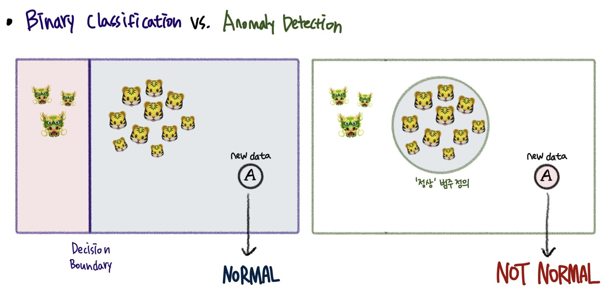
</p>

전통적인 지도학습(Supervised Learning) 관점에서 Binary Classification은 주어진 데이터를 잘 구분하는 분류 경계면(Decision Boundary)을 잘 찾아내는 것을 목적으로 합니다. 위 그림의 예를 봅시다. 만일 호랑이🐯가 Normal이고 용🐲이 Abnormal 데이터라고 한다면, **Binary Classifier**는 **새로운 데이터 "A"를** 무엇으로 판단할까요? Normal Class의 경계면 안쪽에 속해있기 때문에 **Normal이라고 판단**할 것입니다.    

이때 우리는 이러한 질문을 던질 수 있습니다. **Abnormal🐲 관측치가 절대적으로 적은 상황에서, 해당 데이터가 Abnormal Class를 대표할 수 있는가?"** 에 대해 말입니다. 
왜냐하면 적은 관측치를 바탕으로 생성된 분류 경계면을 온전히 신뢰할 수 없기 때문이죠. 생각해보니 새로운 데이터 "A"는 'Normal'이라고 판단하기에는 다른 정상 관측치들(🐯)과는 Feature Space 상의 거리가 꽤 먼 것을 볼 수 있습니다.  
 
바로 이러한 문제를 바탕으로, Anomaly Detection은 **Normal 데이터는 충분히 많으니, "정상"이란 무엇인가를 정의하여 이에 포함되지 않는 것을 걸러내보자**는 아이디어에서 출발하게 됩니다. 이러한 관점에서 **새로운 데이터 "A"** 는 Anomaly Detection의 관점에서는 **Normal이 아닌 것**으로 재정의되겠죠.   

> **(참고)**   
> Normal이 아니라고 해서 데이터가 반드시 "Abnormal"인 것은 아닙니다. 하지만 현 관측치를 기준으로 보았을 때 해당 데이터는 우리가 규정한 "Normal"이라 하기에는 어려움이 있습니다. 이러한 접근법이 유효한 이유는 "Abnormal"의 종류가 2가지일 때입니다. 가용할 수 있는 불량 관측치가 하나의 유형(이를테면 🐲)밖에 없는 상황에서, 한 번도 관측되지 못했던 새로운 불량 유형(이를테면 🦁)을 발견할 수 있다는 이점을 가지기 때문입니다.
> 
> 이처럼 Classification은 데이터를 반드시 주어진 범주 중 하나로 할당하지만, Anomaly Detection은 정상의 Boundary를 정하고 '정상' '정상이 아님'으로 보다 광범위한 분류가 가능하다는 측면에서 둘은 차이를 가집니다. 즉, Anomaly Detection은 일반적인 데이터의 범주와 확연히 구분되는 다른 양상의 데이터를 찾는 것이죠. 이러한 관점에서 Anomaly Detection을 통해 찾아낸 데이터는 불량, 오류, 악성코드, 가짜 데이터일 수도 있지만, 예외, 새로운 패턴 등의 데이터일 수도 있습니다.

<br/>

## Assumption of Anomaly Detection
이상치 데이터의 기본 가정은 **정상 데이터가 정상이 아닌 데이터보다 훨씬 더 많다**(There are considerably more "normal" observations than abnormal observations in the data)입니다. 그리고 모델링 시에는 **오로지 정상 데이터만을 활용하여 모델을 학습**시킨 후, 정상 범위를 정의하여 이상을 탐지해낸다는 가정을 기저로 활용하고 있습니다.   

<br/>

-------

# Dive into Anomaly Detection Using AutoEncoder with Time Series Data
이러한 점을 바탕으로, 본 튜토리얼에서는 Anomaly Detection에 대해서, 그 중에서도 딥러닝 모델을 바탕으로 수행되는 **AutoEncoder Based Anomaly Detection**에 대한 간략한 소개 및 활용 방안에 대해 소개해보고자 합니다. 이때 **딥러닝 기법을 활용한 모델 기반의 Anomaly Detection을 소개하는 이유는, 데이터가 내포하는 정보를 최대한 활용하는 동시에 구조를 유연하게 바꾸어가며 모델 성능을 높일 수 있는 장점을 가지기 때문**입니다. 따라서 모델을 학습시킬 만큼의 충분한 데이터가 있다면 본 튜토리얼을 통해 딥러닝, 그 중에서도 AutoEncoder를 이용한 Anomaly Detection의 기본을 알아갈 수 있을 것입니다.

특히 본 튜토리얼에서는 **시계열 데이터에 있어 이상 탐지에 대한 튜토리얼**을 작성하고자 하며, 활용하고자 하는 데이터는 **Real-World Time Series Dataset 중 Electrocardiogram(ECG) 심전도 데이터셋**입니다. 

## AutoEncoder
<p align="center">
    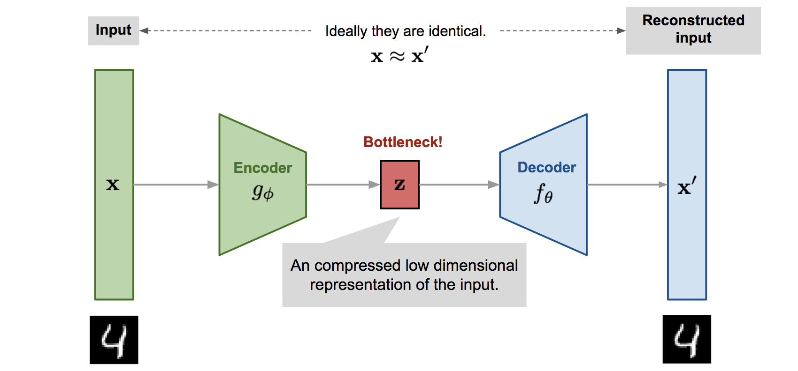
</p>

AutoEncoder는 통상적으로 위와 같은 구조를 가지는 모델로, **입력과 출력이 동일한 인공 신경망 구조**를 바탕으로 **입력으로 받은 데이터(x)를 출력으로 최대한 가깝게 재구축(x')하는 것을 목적**으로 하고 있습니다. 분석 데이터셋이 어떤 형태인지(e.g. Time Series, Image, NLP, etc.)에 따라서 다양한 종류의 모델을 설계할 수 있지만, 기본적인 구조는 모두 동일합니다.   

- **Encoder**: 주어진 Input을 차원 축소를 통해 Latent Vector(= Hidden Representation)로 변환하는데, 이때 원본 데이터의 정보를 잘 보존하는 방향으로 압축하는 것이 Enocder의 목적입니다.   
- **Decoder**: 일종의 Generator로서, Input으로 들어온 Latent Vector를 이용하여 다시 Input과 유사하게 데이터를 재구축(Reconstruction)하는 역할을 수행합니다.   
- **Objective Function**: $l(f(x)) = \frac{1}{2}\sum_{k}(\hat{x_k}-x_k)^2$   
    - **실제 Input과 재구축한 Output 간의 차이를 최소화 하는 방향으로 모델 Parameters가 업데이트** 되도록 함을 의미합니다. 즉, 재구축된 Output(x')와 Input(x) 간의 차이를 줄이는 방향으로 학습이 이루어지는 것이죠.   
    - 이를 **Reconstruction Error**라고도 합니다.   

<br/>

**그렇다면 어떻게 자기 자신을 입력으로 넣어 다시 재구축하는 것이 이상치 탐지가 되는 걸까요?**   
- 학습 시 Normal 데이터만을 활용한다면, **AutoEncoder는 Normal 값을 가지는 데이터의 주요한 특징들을 잘 파악하는 방향으로 학습이 이루어질 것**입니다. 따라서 제대로 학습된 모델은 정상적인 데이터에 대해서는 Reconstruction을 훌륭하게 수행할 수 있습니다.
- 그러나 만일 Anomaly 데이터가 들어온다면, 학습 시 한 번도 Anomlay를 보지 못했던 AutoEncoder는 Recosntruction을 잘 수행하지 못할 것입니다. 오로지 **Normal의 특징만을 학습했기 때문에, 정상이 아닌 특징을 가진 데이터에 대해서는 Reconstruction에 어려움을 겪는 것**이죠.
- 따라서 위 목적 함수에서 Reconstruction Error 값이 일정 수준(Threshold) 이상 높아진다면, 이를 Anomaly라 판단할 수 있는 것입니다.
    - 그렇다면 이 'Threshold'는 어떻게 정의해야 할가요? 그 기준은 데이터셋마다 그리고 도메인마다 다르므로, 본 튜토리얼에서는 **실험을 통해 적절한 Threshold를 정하는 과정을 아래에 소개**하고자 합니다.

<br/>

## Data
### Description
본 튜토리얼에서 다룰 데이터는 ECG(Electrocardiogram), 즉 심전도 데이터입니다. 심전도란 심장의 전기적 활동을 신체 표면에서 측정한 전기적 신호를 의미하며, 이를 통해 부정맥 등 심장 질환 여부를 파악해낼 수 있습니다. 본 튜토리얼에서 사용한 데이터셋은 총 2가지이며, [MIT-BIH Arrhythmia Database](https://physionet.org/content/mitdb/1.0.0/)와 [PTB Diagnostic ECG Database](https://www.physionet.org/content/ptbdb/1.0.0/)가 그것입니다. MIT-BIH는 심부전증 여부를 판단하기 위해 총 47명의 피험자로부터 수집한 심전도 데이터셋으로, 총 5개의 Class로 구분됩니다. PTB는 290명의 피험자로부터 데이터를 수집하였으며, 290명 중 52명의 피험자만이 Normal Class를 가집니다.   
본 튜토리얼에서는 두 데이터셋을 합쳐 Normal과 Abnormal로 구분하였고, Normal의 경우 PTB 데이터에서 52명의 건강한 피험자의 기록을 사용하였으며, MIT-BIH의 환자 데이터와 PTB 데이터의 238개의 환자 데이터 기록을 사용하였습니다.

> __[(참고)](https://www.heartandstroke.ca/heart-disease/tests/electrocardiogram)__   
> **ECG**: "An electrocardiogram (ECG or EKG) is a test that checks how your heart is functioning by measuring the electrical activity of the heart. With each heart beat, an electrical impulse (or wave) travels through your heart. This wave causes the muscle to squeeze and pump blood from the heart."

ECG의 Normal/Abnormal 여부는 정상적인 심장 박동인지, 부정맥과 관련한 심장 박동인지를 구분하는 것으로 정의될 수 있습니다. 이때 Abnormal 즉 부정맥의 종류는 여러 개이지만, 
**본 튜토리얼이 Anomaly Detection에 대한 것임을 고려하여서 Normal이 아닌 Class는 모두  Anomaly로 정의**합니다. 이후 Normal(N)이 아닌 Abnormal를 검출할 수 있는 모델을 설계해보겠습니다.

### Download
[해당 링크](https://github.com/ashukid/anomaly-detection-in-ecg-signal/tree/master/input/ecg-data-mit-arrhythmia-ptb)를 통해서 데이터를 바로 다운 받으실 수 있습니다.

### Prepare Data
데이터를 다운 받고 이상치 탐지에 필요한 데이터를 준비해보겠습니다. 이때 필요한 **Hyperparameter**는 **Train/Validation/Test 과정에서 활용할 Normal 데이터의 비율**입니다. 더불어 **Validation 과정에서 필요한 Abnormal 데이터의 비율** 역시 정의할 필요가 있습니다. 보다 자세한 Hyperparameter는 [Parameters](#parameters)에서 확인하실 수 있습니다.

__Example of Use__
```python
import os, glob, sys, time, random, shutil, pickle, tqdm
import numpy as np
import pandas as pd
from colorama import Fore
from sklearn.metrics import accuracy_score, confusion_matrix, f1_score

import torch
from torch import nn
import torch.optim as optim
import torch.nn.functional as F
from torch.utils.data import Dataset, DataLoader

from Utils.saver import Saver
from Utils.logger import get_tqdm_config
from Utils.earlystopping import EarlyStopping

# For visualiation
%matplotlib inline
import matplotlib
import matplotlib.pyplot as plt
import seaborn as sns
sns.set_context("talk")
sns.set_style("white")
sns.set_palette("Pastel1")
plt.rcParams['axes.labelsize'] = 14
plt.rcParams['xtick.labelsize'] = 14
plt.rcParams['ytick.labelsize'] = 14
matplotlib.rc('font', family='Malgun Gothic')  # For Windows
plt.rcParams['axes.unicode_minus'] = False

import warnings
warnings.filterwarnings(action='ignore')

# Seed 고정
def set_seed(seed=2022):
    random.seed(seed)
    os.environ['PYTHONHASHSEED'] = str(seed)
    np.random.seed(seed)
    torch.manual_seed(seed)
    torch.cuda.manual_seed(seed)
    torch.backends.cudnn.deterministic = True
set_seed()
```
- 필요한 라이브러리를 불러오고 Seed를 고정시켰으니, 이제 분석에서 사용할 데이터를 불러오고 정의해보겠습니다.

- `Utils/`에 들어가시면 학습에 필요한 모듈들을 추가적으로 정의해 놓았습니다.

```python
class ECG_TrainDataset(Dataset):
    
    def __init__(self, data_dir):
        self.data=pd.read_csv(data_dir, header=None)
        
    def __getitem__(self,idx):
        x = self.data.loc[idx,:186].values  # Label 제거
        return x
    
    def __len__(self):
        return len(self.data)
```
```python
class ECG_TestDataset(Dataset):
    
    def __init__(self,path,disease_type):
        self.data=pd.read_csv(path,header=None)
        
        # All values of specific disease (모든 부정맥 환자를 Anomaly로 정의)
        if(disease_type != -1):
            self.data = self.data[self.data[config.seq_len]==disease_type].values[:, :config.seq_len]
        
        # Equal values from all disease
        else:
            how_many=20
            temp=np.zeros(shape=(6 * how_many,config.seq_len))
            for i in range(6):
                temp[i*how_many:(i+1)*how_many,:]=self.data[self.data[config.seq_len]==i].values[:how_many,:config.seq_len]
                
            self.data=temp
          
        print(self.data.shape)
        
    def __getitem__(self,idx):
        x=self.data[idx,:config.seq_len] # Label 제거
        return x
    
    def __len__(self):
        return len(self.data)
```
```python
data_dir = './Data/'
device = torch.device("cuda:0" if torch.cuda.is_available() else "cpu")

class dataset_config:
    # Dataloader
    batch_size=64
    workers=0
    lr=1e-3
    
    # Dataset
    normal_train_path = data_dir+"normal_train.csv"
    normal_valid_path = data_dir+"normal_valid.csv"
    patient_valid_path = data_dir+"patient_valid.csv"
```
```python
# Define train/valid/testloader
normal_train = ECG_TrainDataset(dataset_config.normal_train_path)
train_loader = DataLoader(normal_train, batch_size=dataset_config.batch_size, shuffle=True, num_workers=dataset_config.workers)

normal_test = ECG_TestDataset(dataset_config.normal_valid_path, 10)
nor_testloader = DataLoader(normal_test, batch_size=1, shuffle=False, num_workers=dataset_config.workers)

abnormal_test = ECG_TestDataset(dataset_config.patient_valid_path, -1)
ab_testloader = DataLoader(abnormal_test, batch_size=1, shuffle=False, num_workers=dataset_config.workers)
```

```python
for x in train_loader:
    print(x.shape, x.dtype)
    x = x.numpy()
    x = pd.DataFrame(x)
    x.iloc[:10,:].T.plot(figsize=(20,8))
    plt.show()
    break
```
<p align="center">
    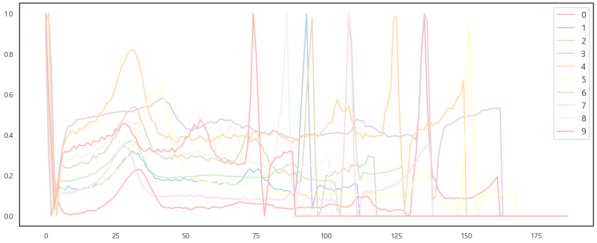
</p>


- 위 그림은 Trainloader 내의 정상 ECG 데이터 중 일부 데이터셋을 시각화 한 것입니다. **우리가 정의한 Trainloader가 제대로 동작하는 것을 확인하였으니, 이제 본격적으로 모델 학습을 수행**해보겠습니다.

<br/>

----

<br/>

# Anomaly Detection Using AutoEncoder PyTorch Implementation
이제 본격적으로 PyTorch를 이용하여 AutoEncoder를 구축하고, Normal 데이터만을 활용하여 모델을 학습 후 이상치 탐지 결과를 알아보려합니다. **먼저 가장 기본적인 Multi-Layer Perceptron(MLP)를 이용한 AutoEncoder를 구축**해보겠습니다.

## AutoEncoder
```python
class model_config:
    seq_len = 187
    hidden_1 = 500
    hidden_2 = 100
```
- 모델 학습에 필요한 Hyperparameter 목록입니다. 이때 seq_len은 하나의 ECG signal의 데이터가 가지는 point의 개수를 의미하며, hidden_# 은 각각 모델의 MLP 노드의 개수를 의미합니다. 즉, AutoEncoder Bottelneck Layers를 정의하는 부분입니다.
```python
class MLPAutoEncoder(nn.Module):
    def __init__(self, config: object):
        super().__init__()
        self.seq_len = config.seq_len
        self.hidden_1 = config.hidden_1
        self.hidden_2 = config.hidden_2
        self.hidden_3 = config.hidden_3
        
        self.Encoder=nn.Sequential(
            nn.Linear(self.seq_len, self.hidden_1),
            nn.ReLU(inplace=True),
            
            nn.Linear(self.hidden_1, self.hidden_2),
            nn.Softmax(dim=1),
            
            nn.Linear(self.hidden_2, self.hidden_3),
            nn.Softmax(dim=1),
        )
        
        self.Decoder=nn.Sequential(
            
            nn.Linear(self.hidden_3, self.hidden_2),
            nn.ReLU(inplace=True),
            
            nn.Linear(self.hidden_2, self.hidden_1),
            nn.ReLU(inplace=True),
            
            nn.Linear(self.hidden_1, self.seq_len),
            nn.Sigmoid()
        )
        
    def forward(self, x):
        x = x.view(-1, self.seq_len)
        latent_vector=self.Encoder(x)
        pred = self.Decoder(latent_vector)
        
        return pred.view(-1, self.seq_len)       
```
```python
print(MLPAutoEncoder(model_config))
```
```
MLPAutoEncoder(
  (Encoder): Sequential(
    (0): Linear(in_features=187, out_features=500, bias=True)
    (1): ReLU(inplace=True)
    (2): Linear(in_features=500, out_features=100, bias=True)
    (3): Softmax(dim=1)
    (4): Linear(in_features=100, out_features=32, bias=True)
    (5): Softmax(dim=1)
  )
  (Decoder): Sequential(
    (0): Linear(in_features=32, out_features=100, bias=True)
    (1): ReLU(inplace=True)
    (2): Linear(in_features=100, out_features=500, bias=True)
    (3): ReLU(inplace=True)
    (4): Linear(in_features=500, out_features=187, bias=True)
    (5): Sigmoid()
  )
)
```
- 구축한 모델의 구조는 위와 같습니다. 앞서 언급한 바와 같이 **Encoder와 Decoder는 대칭 구조를 이루고 있습니다**. 자, 이제 모델 학습 후 학습 결과를 확인해보겠습니다.

## Training
```python
class train_config:
    lr = 1e-3
    weight_decay = 1e-2
    epochs = 70
```
- 학습에 필요한 Hyperparameter를 정의하였습니다. **재구축 오차는 MSE Loss를 이용**합니다.
```python
def loss_function(pred, real):
    mse = F.mse_loss(pred, real, reduction="sum")
    return mses
```

```python
class ADTrainer(object):
    def __init__(self, config: object, model, check_path: str):
        self.check_path = check_path
        
        # Define Dataloader
        self.train_loader, self.valid_loader = train_loader, nor_validloader
        
        # Define Saver
        self.saver = Saver(path = check_path)
        
        # Define logging train history
        self.history = {'loss': {'train': [], 'valid': []}}
        
        # Define Model
        self.model = model.to(config.device)
        
        # Define Optimizer
        self.optimizer = torch.optim.Adam(model.parameters(), lr=config.lr, weight_decay=config.weight_decay)
        
        
    def save_and_plotting_training_history(self):
            
        with open(os.path.join(self.check_path,'Anomaly_Detection_History.pkl'), 'wb') as f:
            pickle.dump(self.history, f)

        train_mse_loss = self.history['loss']['train']
        plt.plot(train_mse_loss,label='train')
        plt.plot(self.history['loss']['valid'],label='valid')
        plt.title("Reconstruction Loss")
        plt.legend()
        plt.savefig(os.path.join(self.check_path, 'Reconstruction_loss.png'))
        plt.close('all')
        
        
    def run(self):
        
        # EarlyStopping moduler
        earlystopping = EarlyStopping(patience=config.early_stop_patience, path = self.check_path)
        
        with tqdm.tqdm(**get_tqdm_config(total=config.epochs, leave=True, color='red')) as pbar:
            
            valid_best_mse = float('inf')
            
            for epoch in range(1, config.epochs+1):
                
                # train & Valid
                self.history['loss']['train'].append(self.train(self.train_loader))
                self.history['loss']['valid'].append(self.evaluate(self.valid_loader))
                
                # Logging
                desc = f" Epoch [{epoch:>04}/{config.epochs:>04} |"
                for metric_name, metric_dict in self.history.items():
                    for k, v in metric_dict.items():
                        desc += f" {k}_{metric_name}: {v[-1]:.4f} |"
                    
                # Save model if it is the current best
                valid_mse = self.history['loss']['valid'][-1]
                if valid_mse < valid_best_mse:
                    valid_best_mse = valid_mse
                    self.saver.checkpoint('best_model', self.model, is_best=False)
                    
                earlystopping(self.history['loss']['valid'][-1], self.model)
                if earlystopping.early_stop:
                    break
                
                pbar.set_description_str(desc)
                pbar.update(1)
                
        self.save_and_plotting_training_history()
        
    def _set_learning_phase(self, train: bool = False):
        if train:
            self.model.train()
        else:
            self.model.eval()
        
        
    def train(self, train_loader):
        steps_per_epoch = len(train_loader)
        self._set_learning_phase(True)
        result = {'loss': torch.zeros(steps_per_epoch, device=config.device)}
        
        with tqdm.tqdm(**get_tqdm_config(total=steps_per_epoch, leave=False, color='cyan')) as pbar:
            for i, signal in enumerate(train_loader):
                signal = signal.to(config.device).float()
                
                preds = self.model(signal)
                loss = loss_function(preds, signal)
                
                self.optimizer.zero_grad()
                loss.backward()
                torch.nn.utils.clip_grad_norm_(self.model.parameters(), config.optim_clip_value)
                self.optimizer.step()
                
                # For Save Information
                result['loss'][i] = loss.item()
                
                desc = f" Batch [{i + 1:>04}/{len(self.train_loader):>04}"
                pbar.set_description_str(desc)
                pbar.update(1)
                
        return result['loss'].mean().item()
    
    
    @torch.no_grad()
    def evaluate(self, valid_loader):
        steps_per_epoch = len(valid_loader)
        self._set_learning_phase(False)
        result = {'loss': torch.zeros(steps_per_epoch, device=config.device)}
        
        with tqdm.tqdm(**get_tqdm_config(total=steps_per_epoch, leave=False, color='yellow')) as pbar:
            for i, signal in enumerate(valid_loader):
                signal = signal.to(config.device).float()
                
                preds = self.model(signal)
                loss = loss_function(preds, signal)
                result['loss'][i] = loss.item()
                
            desc = f" Batch [{i + 1:>04}/{len(self.valid_loader):>04}"
            pbar.set_description_str(desc)
            pbar.update(1)
                
        return result['loss'].mean().item()
```
- 모델을 학습할 Trainer를 From scratch로 정의하였습니다. Valid Loss를 기준으로 하여 가장 성능이 좋은 파라미터를 저장하고 Epoch 별 학습 및 검증 성능을 출력합니다.


```python
model = MLPAutoEncoder(config)
Trainer = ADTrainer(config = config, model = model, check_path = './Results/MLP')
Trainer.run()
```
```
Epoch [0100/0100 | train_loss: 93.6023 | valid_loss: 1.4745 |: |          | [01:31<00:00,  1.10it/s] 
```
<p align="center">
    
</p>

- Train Loss를 시각적으로 확인해보니 Loss가 잘 수렴하며 학습이 이루어진 것 같습니다. 다만 Valid Loss와 Train Loss 간의 차이가 있기에, 검증이 제대로 이루어졌는지에 대한 확인이 필요합니다. 이제 해당 모델을 바탕으로 Anomaly Detecion을 수행해보려합니다.   

- 그 이전에, Anomaly를 정의하기 위해서는 **Normal이 무엇인지에 대한 정의**를 세워야 합니다. 그 **Threshold를 정해야 Normal이 아닌 것을 Anomaly라고 말할 수 있기 때문**입니다.

<br/>

## Choosing a Threshold
- 본 튜토리얼에서는 Threshold를 정하기 위해서 **학습 시 사용되지 않았던 Normal 데이터와 Abnormal 데이터를 이용**해보려 합니다. 두 데이터를 이용하여 **Loss의 Threshold를 설정**하고, **실제 Label 값을 가장 잘 맞추는 Threshold를 이용하여 최종 cutoff를 지정**할 것입니다.

    - 즉, MSE를 통한 재구축 오차(Reconstruction Error) 값을 비교하여 실제 Label이 잘 구분되는 지점을 Threshold로 지정합니다.

    - Classification 성능은 **F1 Score를 이용**합니다.

```python
model = MLPAutoEncoder(model_config).to(device)
model.load_state_dict(torch.load('./MLP_AE_epoch_70.pt'))
```
```python
def plot_signal(loader, title: str):
    model.eval()
    for i, signal in enumerate(loader):
        signal = torch.FloatTensor(signal).to(device).float()
        preds = model(signal)
        loss=loss_function(preds, signal)
        break
    
    input = signal.detach().cpu().numpy()
    pred = preds[0].detach().cpu().numpy()
    
    plt.figure(figsize=(15, 8))
    plt.plot(list(range(model_config.seq_len)), input,label="Original")
    plt.plot(list(range(model_config.seq_len)), pred,label="Predicted")
    plt.title(f"{title}, Reconstrunction Error: {loss.item()}")
    plt.legend(prop={'size': 20})
    
plot_signal(normal_test, title="Normal")
plot_signal(abnormal_test, title="Abnormal")
```
<p align="center">
    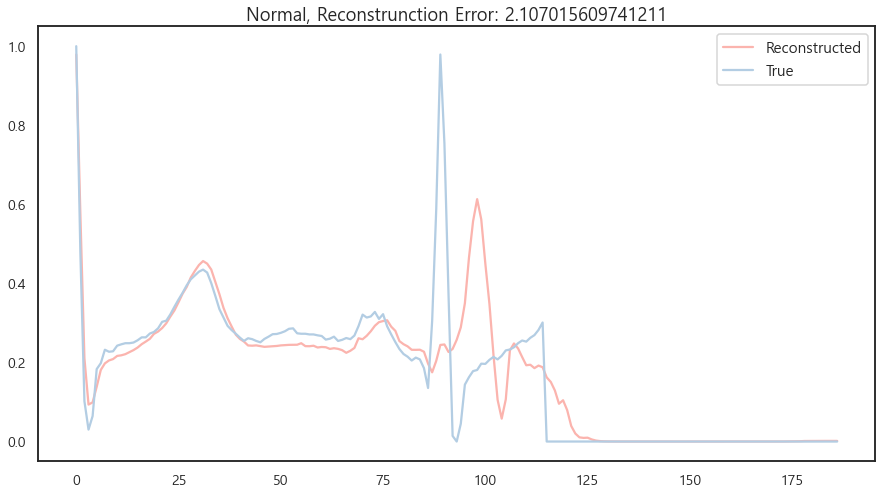
</p>
<p align="center">
    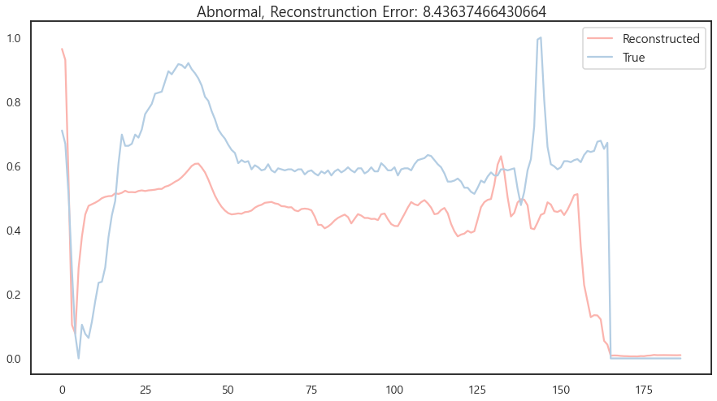
</p>

- 먼저 정상 데이터로 학습된 모델을 통해서 학습 시 보지 못했던 **Normal 데이터와 Abnormal 데이터 간의 MSE Loss 및 Input 재구축 결과를 시각적으로 비교**해보았습니다.

- 확인 결과 우리의 MLPAutoEncoder는 **Normal 데이터셋에 대해서는 비교적 시각적으로 유사하며 MSE Loss도 낮은** 반면, **Abnormal 데이터셋에 대해서는 상대적으로 높은 Loss 값을 보이는 것을 확인**할 수 있습니다. 더불어 **재구축 된 결과도 시각적으로 달라, 해당 모델을 통해 Threshold를 정하고 Anomaly 탐지를 수행**해보고자 합니다.

```python
def get_loss(loader):
    model.eval()
    total_loss=[]
    for i, signal in enumerate(loader):
        signal=signal.to(config.device).float()
        output=model(signal)
        loss=loss_function(output,signal)
        total_loss.append(loss.item())

    return np.array(total_loss)

def normalize_loss(loss, doit=True):
    if(not doit):
        return loss
    global max_loss, min_loss
    loss=(loss - min_loss)/(max_loss - min_loss)
    return loss
```
- 먼저 Loss를 얻고, 이를 0과 1 사이로 Normalize 해보겠습니다. 이로써 Threshold의 범위는 0과 1 사이에서 찾을 수 있을 것입니다.

```python
nor_loss = get_loss(nor_validloader)
abnor_loss = get_loss(ab_testloader)

max_loss = max(nor_loss.max(), abnor_loss.max())
min_loss = min(nor_loss.min(), abnor_loss.min())

nor_loss = normalize_loss(nor_loss)
abnor_loss = normalize_loss(abnor_loss)
```

```python
def find_optimal_threshold(nor_loss, abnor_loss):
    
    optimal_threshold=0
    optimal_f1score=0
    
    for threshold in np.arange(0, 1, 0.01):
        normal_pred = []
        for x in nor_loss:
            pred=1 if x > threshold else 0
            normal_pred.append(pred)

        abnormal_pred = []
        for x in abnor_loss:
            pred=1 if x > threshold else 0
            abnormal_pred.append(pred)

        normal_pred=np.array(normal_pred)
        normal_true=np.zeros_like(normal_pred)
        abnormal_pred=np.array(abnormal_pred)
        abnormal_true=np.ones_like(abnormal_pred)

        tp=sum(abnormal_pred)
        fp=sum(normal_pred)
        tn=len(normal_pred)-fp
        fn=len(abnormal_pred)-tp
        
        
        precision=tp/(tp+fp)
        recall=tp/(tp+fn)
        f1score=(2*(precision*recall))/(precision+recall)
        
        if(f1score > optimal_f1score):
            optimal_fscore=f1score
            optimal_threshold=threshold
        
    return optimal_threshold
```
```python
threshold = find_optimal_threshold(nor_loss, abnor_loss)
print(threshold)
```
```
0.1
```
- 최적의 Threshold 탐색 결과, 0.1에서 F1 Score가 가장 높은 것으로 확인되었습니다. 이제 이 값을 통해 Precision, Recall, F1 Score 값을 각각 확인해보겠습니다.

- 이때 F1 Score는 Precision과 Recall의 조화 평균을 계산하는 데 있어 두 값에 가중치 $\beta$를 부여하여 값을 조절합니다.   

$$F_{\beta } = (1+\beta ^2)\frac{Precision\times Recall}{(\beta ^2 \times Precision)+Recall}$$

- $\beta $ 값이 1보다 크면 Recall에 큰 가중치를 부여하고, 1보다 작으면 Precision에 큰 가중치를 부여하여 계산됩니다.

## Evaluation
```python
def print_metrics(nor_loss, abnor_loss, threshold, beta: float):
    normal_pred=[]
    for x in nor_loss:
        pred=1 if x > threshold else 0
        normal_pred.append(pred)

    abnormal_pred=[]
    for x in abnor_loss:
        pred=1 if x > threshold else 0
        abnormal_pred.append(pred)

    normal_pred=np.array(normal_pred)
    normal_true=np.zeros_like(normal_pred)
    abnormal_pred=np.array(abnormal_pred)
    abnormal_true=np.ones_like(abnormal_pred)

    tp=sum(abnormal_pred)
    fp=sum(normal_pred)
    tn=len(normal_pred)-fp
    fn=len(abnormal_pred)-tp

    accuracy_normal=tn/len(normal_pred)
    accuracy_abnormal=tp/len(abnormal_pred)
    accuracy_total=(tp+tn)/(len(normal_pred)+len(abnormal_pred))

    precision=tp/(tp+fp)
    recall=tp/(tp+fn)
    num=(1+beta**2)*(precision*recall)
    den=((beta**2)*precision)+recall
    f1score=num/den

    print(f"Accuracy Normal: {accuracy_normal*100:.2f}%")
    print(f"Accuracy Abnormal: {accuracy_abnormal*100:.2f}%")
    print(f"Accuracy Total: {accuracy_total*100:.2f}%")

    print(f"Precision : {precision:.3f}")
    print(f"Recall : {recall:.3f}")
    print(f"F1score : {f1score:.3f}")
    
    
print_metrics(nor_loss, abnor_loss, threshold, beta=0.1)
```
```
Accuracy Normal: 85.83%
Accuracy Abnormal: 82.50%
Accuracy Total: 84.17%
Precision : 0.853
Recall : 0.825
F1score : 0.839
```
- **F1 Score가 0.839라는 괄목할 만한 성능을 보이며 Anomaly Detection을 잘 수행할 수 있음을 실험적으로 확인**하였습니다.
- 더불어 **Abnormal에 대한 정확도 역시 82.50%를 기록하며, 준수한 성능으로 이상치 탐지를 해내는 것을 확인**하였습니다.

<br/>

------

<br/>

# Experiments
## Experiment 1
- 지금까지의 튜토리얼에서는 기본적인 MLP를 이용한 AutoEncder를 구축하였고, 이에 대한 Anomaly Detection 결과를 보았습니다. 이때 앞서 **AutoEncoder는 데이터 타입에 따라서 다양한 형태로 구축이 가능하다고 말한 바 있습니다.**. 즉, **Backbone을 LSTM, CNN 등 데이터 타입에 알맞은 것으로 바꾸어 사용하면 향상된 성능을 기대**할 수 있는 것이죠.

- 우리가 다룬 ECG 데이터셋은 **Time Series Data**이며, 단일 Segment 길이(187)를 맞추기 위해 Zero padding을 한 상황입니다. 이때 **LSTM이나 1D-CNN을 이용하면 보다 Signal의 특징을 추출하는 데 유리하지는 않을까요?**

- 따라서 **Experiment 1**에서는 **시계열 데이터 처리에 용이한 Backbone 구조로 AutoEncoder를 설계하면 보다 좋은 성능이 나올 것이라는 가설**하에, LSTM과 Conv1D AutoEncoder를 설계하고 각각의 성능을 비교해보고자 합니다.

### Parameters
- Datalaoder 호출부터 Model Evaluation까지, **Anomaly Detection에 필요한 주요 Hyperparameter 목록**은 아래와 같습니다.

|__Argument__|__Type__|__Default__|__Help__|
|-------------|-------|------------|-------|
|`data_dir`|str|"./Data/"|csv 데이터 파일이 있는 디렉토리 경로를 입력하시면 됩니다.|
|`normal_train_path`|str|data_dir+"normal_train.csv"|학습 시 사용할 Normal Dataset이 포함된 경로 명을 입력하시면 됩니다.|
|`normal_valid_path`|str|data_dir+"normal_valid.csv"|검증 시 사용할 Normal Dataset이 포함된 경로 명을 입력하시면 됩니다.|
|`patient_valid_path`|str|data_dir+"patient_valid.csv"|검증 시 사용할 Abnormal Dataset이 포함된 경로 명을 입력하시면 됩니다.|
|`num_features`|int|1|ECG 데이터의 변수 개수입니다. 1차원 Signal입니다.|
|`seq_len`|int|187|ECG 데이터의 Sequence Length입니다. 한 파형에 최대 187개가 있으며, 모든 데이터가 187개의 포인트를 가지도록 Zero padding을 수행하였습니다.|
|`hidden_1`|int|500|MLPAutoEncoder 구축 시 필요한 Hidden Dimension입니다. Enocer의 첫 번째 Layer의 output 차원이 됩니다.|
|`hidden_2`|int|100|MLPAutoEncoder 구축 시 필요한 Hidden Dimension입니다. Enocer의 두 번째 Layer의 output 차원이 됩니다.|
|`hidden_dim`|int|20|LSTMAutoEncoder 구축 시 필요한 Hidden Dimension입니다.|
|`epochs`|int|100|Number of epochs to train|
|`train_batch_size`|int|64|Input batch size for training|
|`valid_batch_size`|int|1|Input batch size for validation|
|`test_batch_size`|int|1|input batch size for test|
|`early_stop_patience`|int|50|Number of epochs with no improvement after which training will be stopped.|
|`optimizer`|str|'adam'|Stochastic Gradient Descent Optimizer|
|`lr`|float|1e-2|learning rate|
|`optim_clip_value`|float|5.0|Gradient clip value|
|`early_stop_patience`|int|50|Number of epochs with no improvement after which training will be stopped|
|`device`|str|"cuda:0"|Defualt == "cuda:0", however try torch.device("cuda:0" if torch.cuda.is_available() else "cpu")|


### LSTM AutoEncoder

 
**LSTM(Long Short Term Memory)** 은 기존 RNN이 출력과 먼 위치의 정보를 기억하기 어렵다는 단점을 보완하여 장/단기 기억이 모두 가능하도록 설계한 신경망 구조를 의미합니다. **데이터의 시계열성을 반영**할 수 있다는 장점 덕분에 시계열 데이터 및 자연어 처리에 주로 사용되고 있습니다. 기본적인 LSTM 모델의 구조는 아래 그림과 같습니다.
 <p align="center">
     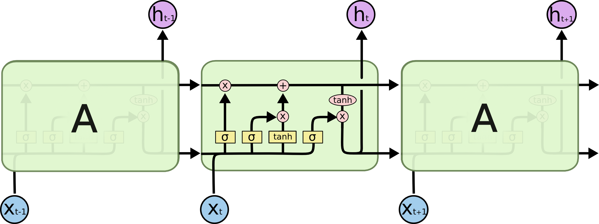
 </p>


```python
class LSTMAutoEncoder(nn.Module):
    def __init__(self, config: object):
        super().__init__()
        # input = (seq_len, Batch, num_features)
        self.hidden_dim = config.hidden_dim
        self.num_features = config.num_features
        self.seq_len = config.seq_len
        
        self.lstm1 = nn.LSTMCell(self.num_features, self.hidden_dim)  # lstm cell = (num_features, hidden_dim)
        self.lstm2 = nn.LSTMCell(self.num_features, self.hidden_dim)
        self.linear = nn.Linear(self.hidden_dim, self.num_features)
        self.sigmoid = nn.Sigmoid()

    def Encoder(self, x):
        ht = torch.zeros(x.size(0), self.hidden_dim, dtype=torch.float, device=config.device)
        ct = torch.zeros(x.size(0), self.hidden_dim, dtype=torch.float, device=config.device)
        
        for input in x.chunk(x.size(1), dim=1):
            ht, ct = self.lstm1(input, (ht, ct))
            
        return ht, ct
    
    def Decoder(self, ht, ct):
        out = torch.zeros(ht.size(0), self.num_features, dtype=torch.float, device=config.device)
        outputs = torch.zeros(ht.size(0), self.seq_len, dtype=torch.float, device=config.device)
        
        for i in range(self.seq_len):
            ht, ct = self.lstm2(out, (ht,ct))
            out = self.sigmoid(self.linear(ht))
            outputs[:, i] = out.squeeze()
            
        return outputs
        
    def forward(self, x):
        
        he, ce = self.Encoder(x)    # hidden encoder, cell_state encoder
        out = self.Decoder(he, ce)
    
        return torch.flip(out, dims=[1])
```
- 위처럼 LSTM AutoEncoder를 정의하였습니다. 이제 모델을 이용하여 학습을 진행해 보겠습니다.

```python
model = LSTMAutoEncoder(config)
Trainer = ADTrainer(config = config, model = model, check_path = './Results/LSTM')
Trainer.run()
```
```python
total_loss = []
model.train()
start = time.time()

# Train Model
for epoch in range(train_config.epochs + 1):
    loss_count=0
    for i, signal in enumerate(train_loader):
        signal = signal.to(device).float()  # batch_size, 187
        model.zero_grad()
        output = model(signal)
        loss = loss_function(output, signal)
        loss_count+=loss.item()

        loss.backward()
        optimizer.step() 

    total_loss.append(loss_count)
    if(epoch % 10 == 0):
        print("Epoch : {} Loss : {}".format(epoch, loss_count))
        # Saving Model
        torch.save(model.state_dict(),"LSTM_AE_epoch_{}.pt".format(epoch))

end = time.time()
time_taken = (end - start)/60
print(f"Total Time Taken : {time_taken:.2f}")
```
```python
plt.plot(list(range(len(total_loss))), total_loss)
plt.xlabel("Total Epochs")
plt.ylabel("Loss value")
plt.show();
```
 <p align="center">
     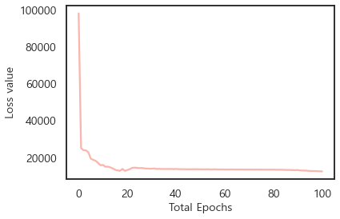
 </p>

- Train Loss를 시각적으로 확인해보니 Loss가 잘 수렴하며 학습이 이루어진 것 같습니다. 이제 해당 모델을 바탕으로 Anomaly Detecion을 수행해보겠습니다.

```python
model = LSTMAutoEncoder(config).to(config.device)
model.load_state_dict(torch.load('./LSTM_epoch_100.pt'))

plot_signal(valid_loader, config, title="Normal")
plot_signal(test_loader, config, title="Abnormal")
```
 <p align="center">
     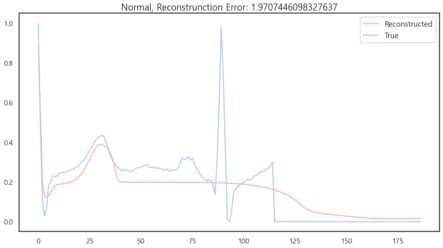
 </p>
  <p align="center">
     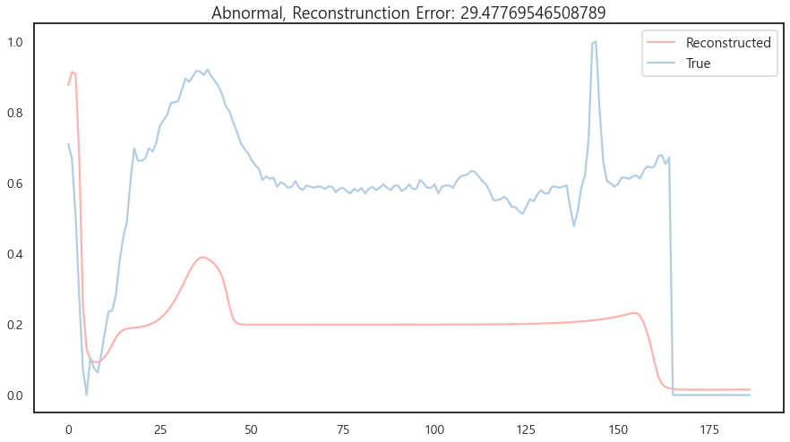
 </p>

- 마찬가지로 Normal을 복원한 값과 Abnormal을 복원한 값은 시각적으로도, 정량적으로도 큰 차이가 나고 있습니다. 이를 바탕으로 Threshold를 정하고 Anomaly Detection을 수행합니다.

```python
nor_loss = get_loss(valid_loader)
abnor_loss = get_loss(test_loader)

max_loss = max(nor_loss.max(), abnor_loss.max())
min_loss = min(nor_loss.min(), abnor_loss.min())

nor_loss = normalize_loss(nor_loss)
abnor_loss = normalize_loss(abnor_loss)
```
```python
threshold=find_optimal_threshold(nor_loss, abnor_loss)
print(threshold)
```
```
0.03
```
```python
print_metrics(nor_loss, abnor_loss, threshold, 1)
```
```
Accuracy Normal: 45.83%
Accuracy Abnormal: 93.33%
Accuracy Total: 69.58%
Precision : 0.633
Recall : 0.933
F1score : 0.754
```
- F1 Score가 0.754로 높은 성능이며 Accuracy Abnormal이 93&를 넘으며 준수한 이상치 탐지 성능을 기록하였으나, 기대했던 성능이 나오는 대신 MLP로 구축한 단순 AutoEncoder보다 낮은 성능을 기록한 것을 확인하였습니다.

- 해당 결과로는 우리의 가설을 증명하기 어렵습니다. 그렇다면 Conv1D로 구축한 AutoEncoder는 다른 성능을 보여줄까요?

<br/>

### Convolution AutoEncoder   

**CNN(Convolution Neural Network)** 은 **Spatial** Pattern을 잡아내는 데 특화된 인공 신경망이며, **LSTM**은 **Temporal** Pattern을 인식하는 데 우수한 성능을 보이는 모델입니다.

- 따라서 CNN 역시 입력 데이터의 특징을 자동으로 검출하는 데 유용하다는 점에서, 입력을 재구축하는 AutoEncoder 기법으로 사용되고, LSTM과 결합되어 ConvLSTM 등의 고도화된 모델로도 활용됩니다.
- 일반적으로 이미지를 처리하는 CNN과 다르게, 1D Convolution은 시계열 데이터를 처리하는 데 유용하기에, 이를 PyTorch로 구현하고 성능을 MLP와 LSTM과 비교해보겠습니다.

 <p align="center">
     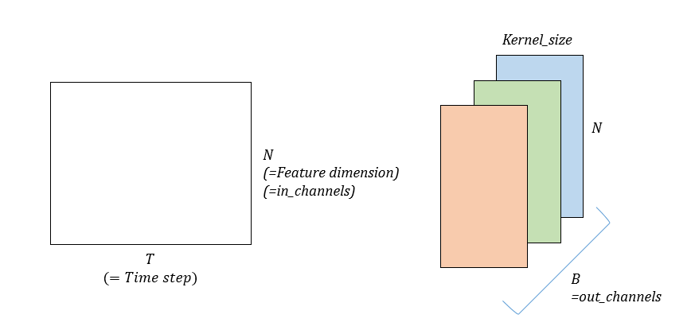
 </p>

<br/>

```python
class ConvAutoencoder(nn.Module):
    
    def __init__(self, config: object):
        super().__init__()

        self.Encoder = nn.Sequential(
            
            nn.Conv1d(config.num_features, 2, 8),
            nn.ReLU(inplace=True),
            nn.MaxPool1d(2),
            
            nn.Conv1d(2,4,11),
            nn.ReLU(inplace=True),
            nn.MaxPool1d(2),
            
            nn.Conv1d(4,8,11),
            nn.ReLU(inplace=True),
            nn.MaxPool1d(2),
            
            nn.Conv1d(8,16,6),
            nn.ReLU(inplace=True),
            nn.MaxPool1d(2),
            
            nn.Conv1d(16,32,5),
            nn.ReLU(inplace=True)
        )
        
        self.Decoder=nn.Sequential(
            
            nn.ConvTranspose1d(32,16,15,1,0),
            nn.ReLU(inplace=True),
            
            nn.ConvTranspose1d(16,8,12,2,0),
            nn.ReLU(inplace=True),
            
            nn.ConvTranspose1d(8,4,12,2,0),
            nn.Sigmoid(),
            
            nn.ConvTranspose1d(4,2,12,2,5),
            nn.Sigmoid(),
            
            nn.ConvTranspose1d(2,1,8,1,0),
            nn.Sigmoid(),
        )
        
    def forward(self, x):
        x = x.view(-1, config.num_features, config.seq_len)
        latent_vector=self.Encoder(x)
        preds=self.Decoder(latent_vector)
        
        return preds.view(-1, config.seq_len)
```
- Conv1D로 구축한 AutoEncoder 구조입니다. 이를 바탕으로 학습을 완료한 이후, evaluation 과정을 통해 나온 Loss 및 재구축 오차를 바탕으로 결과를 시각화해보겠습니다.


```python
def plot_signal(loader, config: object, title: str):
    model.eval()
    for i,signal in enumerate(loader):
        signal=signal.to(config.device).float()
        output=model(signal)
        loss=loss_function(output, signal)

    s1=output[0]
    s2=signal[0]
    
    plt.figure(figsize=(15, 8))
    plt.plot(list(range(187)),s1.detach().cpu().numpy(),label="Reconstructed")
    plt.plot(list(range(187)),s2.detach().cpu().numpy(),label="True")
    plt.title(f"{title}, Reconstrunction Error: {loss.item()}")
    plt.legend(prop={'size': 15})
    
plot_signal(valid_loader, config, title="Normal")
plot_signal(test_loader, config, title="Abnormal")
```

 <p align="center">
     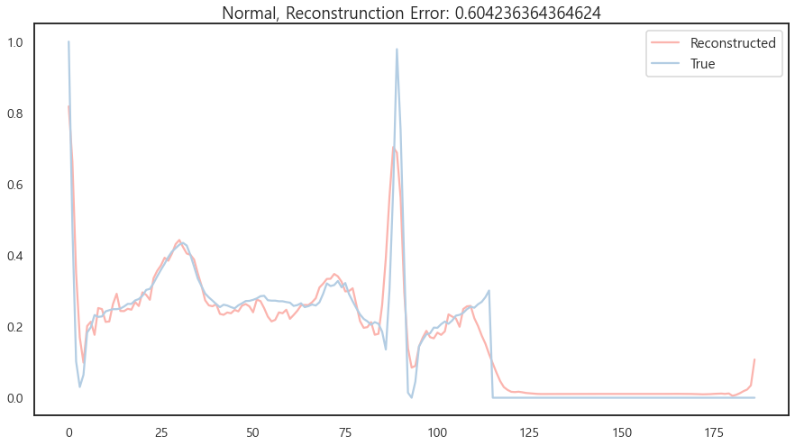
 </p>
  <p align="center">
     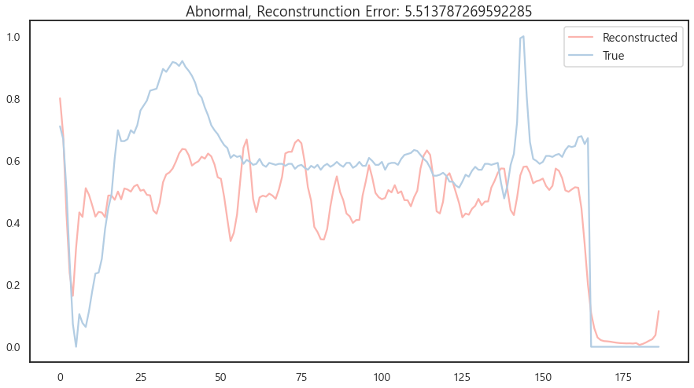
 </p>

- 마찬가지로 정상 데이터와 비정상 데이터의 복원 값 차이가 시각적으로나 정량적으로나 분명히 존재하는 것을 확인하였습니다. 그렇다면 성능은 어떨까요?

```pthon
threshold=find_optimal_threshold(nor_loss, abnor_loss)
print(threshold)
```
```
0.03
```
```python
print_metrics(nor_loss, abnor_loss, threshold, 1)
```
```
Accuracy Normal: 97.50%
Accuracy Abnormal: 80.00%
Accuracy Total: 88.75%
Precision : 0.970
Recall : 0.800
F1score : 0.877
```
- LSTM과 Threshold는 같으나, 훨씬 좋은 성능을 기록한 것을 확인하였습니다.
- Accuracy Normal 및 Abnormal이 모두 좋은 성능을 보이며, Conv1D를 통한 AutoEncoder가 ECG의 이상 심장 박동을 잘 검출할 수 있음을 실험적으로 증명하였습니다.

<br/>

### Result of Experiment 1
결과를 정리하고 해석하겠습니다. 총 Epoch을 100회를 돌린 결과, MLP/LSTM/Conv1D AutoEncoder의 학습 소요 시간 및 성능은 아래와 같습니다.   

|                 |__MLP AutoEncoder__|__LSTM AutoEncoder__|__Conv1D AutoEncoder__|  
|-----------------|:-----------------:|:------------------:|:--------------------:|
|__Training Time (sec)__| __69__ | 854 | 90 |
|__Threshold__| 0.10 | 0.03 | 0.03 | 
|__F1 Score ($\beta = 1.0$)__| 0.84 | 0.75 | __0.88__ | 
|__Accuracy Abnormal (%)__| 82.50 | __93.33__ | 80.00 |

- - MLP, LSTM, Conv1D로 각각 AutoEncoder를 구축해본 결과, **Conv1D에서 가장 좋은 성능을 보였으며 MLP, LSTM 순으로 이상치 탐지 성능이 좋음을 확인**하였습니다.

- 그러나 시계열 데이터 처리에 유용하다고 알려진 LSTM 구조의 모델을 적용하니 오히려 성능 하락을 기록하였습니다. 이로써 **시계열성을 반영할 수 있는 모델 구조를 활용하면 전체적인 성능이 향상될 것**이라는 가설은 증명하기 어려웠습니다.

<br/>

### Conclusion of Experiment 1

- **Conv1D가 더 높은 성능을 보이는 이유**는, **ECG 데이터셋 공간 분포에 대해서 높은 노이즈를 보이기 때문입니다.** 단시간 내에서도 여러 번 요동치는 형태를 보이기에 데이터의 **Spatial Features를 잘 추출할 수 있는 CNN이 높은 성능을 보이는 것으로 판단**됩니다.

- 더불어 시계열 데이터라 하더라도, 본 분석에서 활용한 **ECG 데이터는 관측치가 최대 187개뿐인 소형 데이터셋이기에 시계열적 특성이 크게 두드러지지 않다는 점 역시 LSTM 성능이 다른 모델들보다 낮은 이유가 될 것**입니다.

<br/>

- 그러나 종합적으로 판단해 보았을 때, **ECG의 Anomaly Detection을 위해 Conv1D AutoEncoder를 사용해야 한다고 단언하기는 어렵습니다.**
- **MLP AutoEncoder의 장점은 학습 시간이 가장 빠르다는 것**이며, 더불어 **비교적 높은 성능**을 보이고 있기에 **1차적 이상 탐지 모델로 적극 활용할 수 있다는 특징**을 가집니다.
- **LSTM AutoEncoder**는 학습 시간도 가장 느리고 F1 Score도 상대적으로 낮아 선호되지 않을 수 있지만, **Accuracy Abnormal이 가장 높다는 특징**을 가지고 있습니다.
    - Accuracy Abnormal은 'Abnormal'이라 탐지한 것 중 실제 Abnormal의 비율을 %로 나타낸 것입니다.
    - **ECG를 바탕으로 부정맥과 같은 이상 심장 박동을 탐지하는 헬스케어 분야는 높은 정확도를 요구한다는 특징**이 있습니다. 따라서 긴 학습 시간을 필요로 하더라도 **실제 이상을 정확히 탐지하는 것이 목적이라면, LSTM 모델을 적극적으로 이용**할 수도 있을 것입니다.
    - 본 튜토리얼에서는 다루지 않았으나, 실제로 Signal과 같은 시계열 데이터를 분석함에 있어 CNN과 LSTM을 결합한 모델을 이용하는 경우가 매우 많습니다. 두 모델을 함께 사용하면 Spatial Features 뿐 아니라 Temporal 정보까지 모두 고려할 수 있다는 특장점을 지니게 될 것입니다.

<br/>

## Experiment 2
### Add Regularized Loss! 
앞서 AutoEncoder의 주 목적은 Normal 데이터의 정보를 잘 보존하여 압축하는 것이라 언급한 바 있습니다. 그렇다면 **원본 입력 데이터의 정보가 압축된 Latent Vector와 Input Vector 간 차이를 계산하여 이를 줄일 수는 없을까요?**

<br/>

> __(참고)__   
> **Q. 왜 Bottlencek Layers는 입력 변수의 차원보다 낮아야 하나요? 🤔**   
> **A. 우리가 가지는 고차원의 데이터들은 내재된 잠재 요인, 즉 Latent Variable에 의해 발현되기 때문입니다.**
>
> 따라서 차원 축소를 통해 저차원의 기저 요인들을 잘 압축해서 추출해내는 것이 AutoEncoder의 목적이 됩니다. 이러한 컨셉을 어려운 말로 **Manifold Hypothesis**라고 합니다.
> 

<br/>

- 어떤 대상의 차이를 구하는 방법론은 매우 많습니다. 곧 다루게 될 Semi-Supervised Learning의 방법론 중 Consistency Regularization 기반의 연구들도 일관성 유지를 위해 대상 간 차이를 좁히는 방법을 여러 가지 활용하고 있죠.
    - 그 차이를 정량적으로 측정하는 대표적인 방법으로는 MSE, KL-Divergence, Jensen-Shannon Divergence 등이 있습니다.

<br/>

- 실제로 참고문헌 [1]에서는 **Normal 데이터의 분포와 Latent Vector의 차이를 좁히면 성능 향상을 기대할 수 있다고 주장**한 바 있습니다.
    - 논문에서는 Signal 데이터에 대해서, Latent Vector Representation이 Smooth하지 않고, 연속적인 값을 가지기 어렵다는 점을 지적하며 이러한 문제가 Input Signal에 대한 복원을 어렵게 한다고 주장합니다.
    - 더불어 Objective Function으로 Reconstruction Error만을 활용하여 모델을 구축하면 입력 값의 Outliers까지 학습하여 복원을 어렵게 하는 문제도 함께 지적하고 있습니다.

<br/>

- 따라서 본 튜토리얼에서는 [1]의 방법론을 참고하여 **KL Divergence를 통해 Latent Vector와 Input Data 간 차이를 좁히면 보다 좋은 성능을 도출할 수 있는지**를 확인해보고자 합니다.

<br/>

> __(참고)__   
> __Q. KL Divergence가 무엇인가요? 🤔__   
> __A. Kullback-Leibler Divergence의 준말로, 여기서 Divergence는 "차이"를 의미합니다. 두 확률 분포의 차이를 비교하여 이를 정량적으로 평가하는 척도로서 활용되고 있습니다.__
>
> $$D_{KL}(P||Q) = \sum_{x\in \chi }P(x)log_b(\frac{P(x)}{Q(x)})   $$
> KL divergence는 위 식을 통해 계산되며, 확률 분포 P를 모델링하는 것이 목적이라 할 때, 이산확률분포 P와 Q가 동일한 샘플 공간 $\chi$에서 정의된다고 하였을 때의 값입니다.

<br/>

```python
def loss_function(out, real):
    pred, latent= out[0], out[1]
    z = torch.rand(latent.size(0), latent.size(1), device=device)
    
    mse=F.mse_loss(pred,real,reduction="sum")
    kl=F.kl_div(latent,z,reduction="batchmean")
    
    return kl+mse
```
- Loss Function을 **MSE와 더불어 KL Divergence를 추가하여 함께 최소화 시키는 방향으로 모델 파라미터를 업데이트**하도록 하였습니다.
- 그렇다면 최종적인 Objective Function은 아래와 같아질 것입니다.
$$Objective Function = MSE + KLD$$

<br/>

이때 모델 구조는 아래와 같습니다.
### MLP AutoEnocder for Regularized Loss
```python
class KL_MLPAutoencoder(nn.Module):
    
    def __init__(self, config: object):
        super().__init__()
        
        self.Encoder = nn.Sequential(
            nn.Linear(self.seq_len, self.hidden_1),
            nn.ReLU(inplace=True),
            
            nn.Linear(self.hidden_1, self.hidden_2),
            nn.Softmax(dim=1),
            
            nn.Linear(self.hidden_2, self.hidden_3),
            nn.Softmax(dim=1),
        )
        
        self.Decoder = nn.Sequential(
            
            nn.Linear(self.hidden_3, self.hidden_2),
            nn.ReLU(inplace=True),
            
            nn.Linear(self.hidden_2, self.hidden_1),
            nn.ReLU(inplace=True),
            
            nn.Linear(self.hidden_1, self.seq_len),
            nn.Sigmoid()
        )
        
    def forward(self, x):
        x = x.view(-1, self.seq_len)
        latent_vector=self.Encoder(x)
        pred = self.Decoder(latent_vector)
        
        return pred.view(-1,187),torch.log(latent_vector.view(-1,32))    
```

### LSTM AutoEnocder for Regularized Loss
```python
class KL_LSTMEncoder(nn.Module):
    def __init__(self, config: object):
        super().__init__()
        self.hidden_dim= config.hideen_dim
        self.num_features = config.num_features
        self.seq_len = config.seq_len

        self.lstm1 = nn.LSTMCell(self.num_features,self.hidden_dim)
        self.lstm2 = nn.LSTMCell(self.num_features,self.hidden_dim)
        self.linear = nn.Linear(self.hidden_dim, self.num_features)
        self.sigmoid = nn.Sigmoid()

    def Encoder(self, x):
        ht=torch.zeros(x.size(0),self.hidden_dim,dtype=torch.float,device=device)
        ct=torch.zeros(x.size(0),self.hidden_dim,dtype=torch.float,device=device)
        
        for input in x.chunk(x.size(1),dim = 1):
            ht,ct=self.lstm1(input,(ht, ct))
            
        return ht,ct
    
    def Decoder(self,ht,ct):
        ot=torch.zeros(ht.size(0),self.num_features, type=torch.float, device=config.device)
        outputs=torch.zeros(ht.size(0),187,dtype=torch.float,device=config.device)
        
        for i in range(self.seq_len):
            ht,ct=self.lstm2(ot,(ht,ct))
            ot=self.sigmoid(self.linear(ht))
            outputs[:,i]=ot.squeeze()
            
        return outputs

    def forward(self, x):
        he, ce = self.Encoder(x) #hidden encoder,cell_state encoder
        out = self.Decoder(he, ce)
        return torch.flip(out, dims=[1]), torch.log(F.softmax(he, dim=1))
```

### 1D Convolution AutoEncoder for Regulaized Loss
```python
class KLAutoencoder(nn.Module):
    
    def __init__(self, config: object):
        super().__init__()
        
        self.Encoder=nn.Sequential(
            nn.Conv1d(1,2,8),
            nn.ReLU(inplace=True),
            nn.MaxPool1d(2),
            
            nn.Conv1d(2,4,11),
            nn.ReLU(inplace=True),
            nn.MaxPool1d(2),
            
            nn.Conv1d(4,8,11),
            nn.ReLU(inplace=True),
            nn.MaxPool1d(2),
            
            nn.Conv1d(8,16,6),
            nn.ReLU(inplace=True),
            nn.MaxPool1d(2),
            
            nn.Conv1d(16,32,5),
            nn.Softmax(dim=1),
        )
        
        self.Decoder=nn.Sequential(
            nn.ConvTranspose1d(32,16,15,1,0),
            nn.ReLU(inplace=True),
            
            nn.ConvTranspose1d(16,8,12,2,0),
            nn.ReLU(inplace=True),
            
            nn.ConvTranspose1d(8,4,12,2,0),
            nn.Sigmoid(),
            
            nn.ConvTranspose1d(4,2,12,2,5),
            nn.Sigmoid(),
            
            nn.ConvTranspose1d(2,1,8,1,0),
            nn.Sigmoid(),
        )
        
    def forward(self,x):
        x=x.view(-1,config.num_features, config.seq_len)
        latent_vector=self.Encoder(x)
        fake_signal=self.Decoder(latent_vector)
        
        return fake_signal.view(-1,config.seq_len),torch.log(latent_vector.view(-1,32))
```

### Result of Experiment 2
결과를 정리하고 해석하겠습니다. 총 Epoch을 100회를 돌린 결과, 기존 MLP/LSTM/Conv1D AutoEncoder과 더불어 KL Divergence를 Loss Term에 추가한 모델의 학습 소요 시간 및 성능은 아래와 같습니다.  

|                 |__MLP AutoEncoder__|__LSTM AutoEncoder__|__Conv1D AutoEncoder__|__KL MLP_AutoEncoder__|__KL LSTM_AutoEncoder__|__KL Conv1D AutoEncoder__|   
|-----------------|:-----------------:|:------------------:|:--------------------:|:---:|:---:|:---:|
|__Training Time (sec)__| __69__ | 854 | 90 | 75 | 2720 | 96 |
|__Threshold__| 0.10 | 0.03 | 0.03 | 0.32 |  | 0.03 |
|__F1 Score ($\beta = 1.0$)__| 0.84 | 0.75 | __0.88__ | 0.69 | 0.59 | 0.67 |
|__Accuracy Abnormal (%)__| 82.50 | 93.33 | 80.00 | 84.17 | __99.57__ | 99.17 |

- 실험 결과 동일 조건에서 KL Divergence 연산을 Loss Term만 추가했을 때 **오히려 성능이 낮아지는 것을 확인**하였습니다.
- 논문에서는 동일 조건에서 MSE Loss만을 활용한 MLP, LSTM, Conv1D 모델보다 KL Divergence를 활용했을 때 더 좋은 성능을 낼 수 있다고 주장하지만, Hyperparameter를 논문과는 다르게 변경한 결과 오히려 낮은 성능을 보이는 것을 확인하였습니다.
- 그러나 Accuracy Abnormal의 경우 KL LSTM AutoEncoder가 가장 높았습니다.

<br/>

### Conclusion of Experiment 2

- [1]에서는 epoch을 1000으로 돌리며 Loss가 점점 수렴하는 형태의 Plot을 확인할 수 있었습니다. 따라서 epoch을 100이 아닌 1000으로 늘려 학습하면 논문에서의 성능을 기대할 수도 있을 것입니다. 게다가 Train 시에 활용하는 Dataset Setting 및 Trainer 동작 방식이 논문의 것과는 달랐기에, **Setting 변경에 따라 성능 변화가 크게 남을 실험적으로 확인**하였습니다.
- 하지만 KL Divergence로 **Regularization Term을 추가한 경우, KL LSTM AutoEncoder의 Accuracy Abnormal 성능이 기존의 것보다 훨씬 상향되며 부정맥 검출에 더욱 용이**해진 것을 확인하였습니다.
- 그러나 **연산량이 많고, Hyperparameter 변경에 따라 기대한 만큼의 성능이 도출되지 않았기에, 본 튜토리얼의 Setting으로는 Latent Vector의 Representation이 그다지 유용하지 않음을 확인**하였습니다.
- 또한 Loss 규제를 통해 연산량이 훨씬 많아지며 **Training Cost도 매우 올라간 것을 확인**하였습니다.

<br/>

# Appendix
- 본 튜토리얼에서 Threshold를 설정하는 방법은, 데이터에 정상/비정상을 구분하는 Label이 있다는 가정 하에서 가능한 것입니다. 그러나 실제 데이터셋에는 Label이 없는 경우가 많으며, 따라서 Unsupervised Method를 이용한 Threshold Search 방법론을 추가적으로 탐색하여 적용할 수도 있을 것입니다.

----

<br/>

# References
[1] Chandra, A., & Kala, R. (2019, December). Regularised encoder-decoder architecture for anomaly detection in ECG time signals. In 2019 IEEE Conference on Information and Communication Technology (pp. 1-6). IEEE.
[2] https://curiousily.com/posts/time-series-anomaly-detection-using-lstm-autoencoder-with-pytorch-in-python/